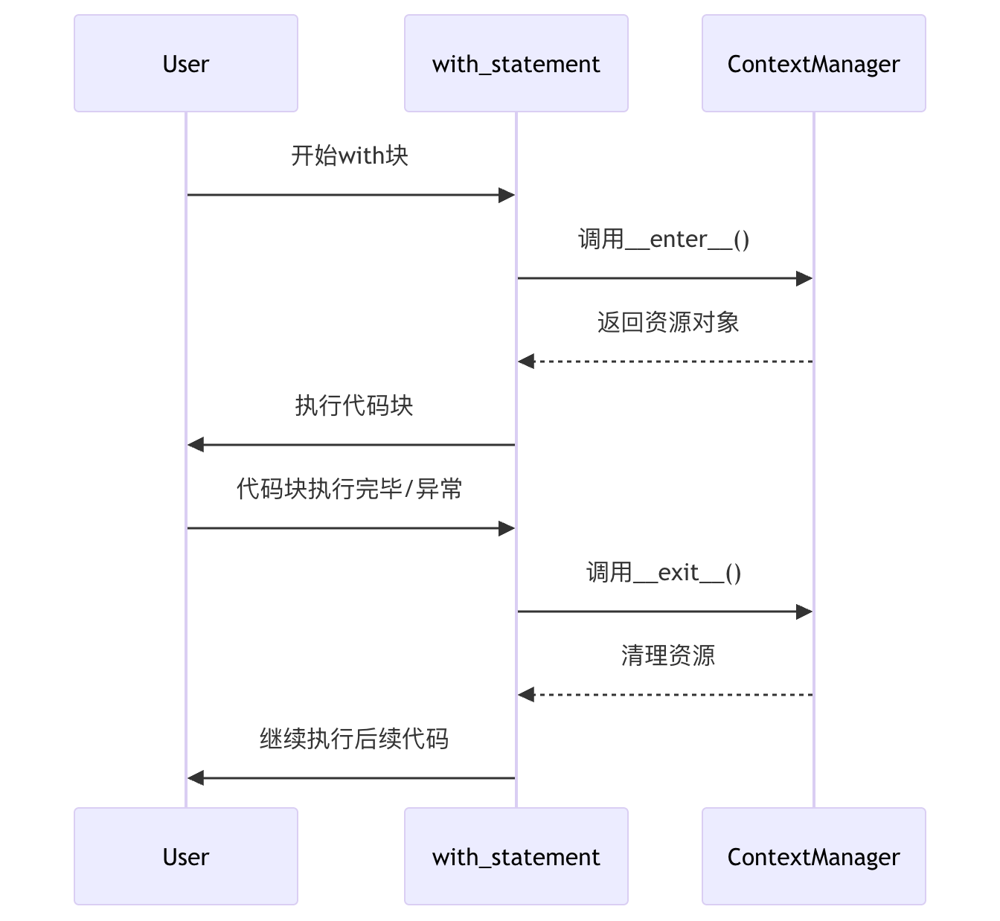

# IO 与文件处理 (File Processing)--文件与路径操作

- [IO 与文件处理 (File Processing)--文件与路径操作](#io-与文件处理-file-processing--文件与路径操作)
  - [1 文件读写](#1-文件读写)
    - [1.1 作用](#11-作用)
    - [1.2 基本流程](#12-基本流程)
    - [1.3 场景与局限性](#13-场景与局限性)
    - [1.4 替代方案](#14-替代方案)
  - [2 with 语句](#2-with-语句)
    - [2.1 基本语法](#21-基本语法)
    - [2.2 工作原理](#22-工作原理)
      - [上下文管理协议](#上下文管理协议)
      - [执行流程](#执行流程)
      - [异常处理机制](#异常处理机制)
    - [2.3 应用场景](#23-应用场景)
    - [2.4 最佳实践](#24-最佳实践)
  - [3 pathlib 路径](#3-pathlib-路径)
    - [3.1 用 pathlib 的好处](#31-用-pathlib-的好处)
    - [3.2 基本语法](#32-基本语法)
    - [3.3 核心类](#33-核心类)
    - [3.4 工作原理](#34-工作原理)
    - [3.5 应用场景](#35-应用场景)
    - [3.6 os.path vs. pathlib](#36-ospath-vs-pathlib)
  - [4 urllib 模块](#4-urllib-模块)
    - [4.1 urllib.request：打开和读取 URL](#41-urllibrequest打开和读取-url)
    - [4.2 urllib.error：处理网络异常](#42-urlliberror处理网络异常)
    - [4.3 urllib.parse：解析和操作 URL](#43-urllibparse解析和操作-url)
    - [4.4 替代方案](#44-替代方案)

## 1 文件读写
- 文件读写是 Python “输入与输出”模块的重要组成部分，它通过 **文件对象（File Objects）** 充当程序与操作系统磁盘数据之间的桥梁。
- 在 Python 中，文件被视为一种可以迭代的对象，支持逐行读取或按需写入。

### 1.1 作用
- **持久化存储**：将内存中的数据（如变量、对象）保存到磁盘，确保程序关闭后数据不丢失。
- **配置管理**：读取 .env 或 json 等配置文件来初始化程序参数。
- **数据交换**：使用 JSON 或 CSV 等标准格式与外部系统共享结构化数据。
- **多媒体处理**：在 Web 框架（如 FastAPI）中处理用户上传的图片、文档等二进制数据。

### 1.2 基本流程
标准的文件操作遵循 **“打开 → 操作 → 关闭”** 的生命周期：

- **打开 (Open)**：调用内置函数 open()，指定文件路径和模式（如只读、写入、追加），获取文件对象。
- **操作 (Operate)**：调用文件对象的方法，如 read() 读取内容、write() 写入数据或 readline() 逐行处理。
- **关闭 (Close)**：显式调用 close() 方法释放系统资源。
    - 推荐是使用 with 语句（上下文管理器），它能实现“预定义的清理操作”，在操作完成后自动关闭文件，即使发生异常也能确保资源安全释放。

demo 示例：[manual_file](../codes/python_base/app/fp/manual_file.py)

### 1.3 场景与局限性
- **适用场景**：
    - 处理小型配置文件。
    - 日志记录（Logging）。
    - 简单的离线数据备份。

- **局限性**：
    - 性能瓶颈：频繁的磁盘 I/O 操作比内存操作慢得多。
    - 并发冲突：原始的文件读写不支持多个进程同时安全地写入同一文件。
    - 检索效率：不像数据库，文件系统难以对海量数据进行复杂的条件查询或索引。

- **其他**:
  - **访问模式**：常用模式包括 'r' (只读)、'w' (只写)、'a' (追加) 和 'b' (二进制模式，用于图片/音频)。
  - **结构化存储**：对于复杂的列表或字典，推荐使用内置的 json 模块 进行序列化（json.dump）和反序列化（json.load）。
  - **临时文件**：在自动化测试（如 pytest）中，可以使用专门的 tmp_path 等 Fixtures 来创建测试完即销毁的临时目录和文件，保证环境整洁。

### 1.4 替代方案
- ``pathlib``：现代 Python 开发推荐使用 pathlib 模块来替代传统的字符串路径操作，它提供面向对象的接口，具有更好的跨平台兼容性。
- ``pickle``：用于将几乎任何 Python 对象序列化为二进制格式（但注意其安全性，仅限信任的数据源）。
- ``StringIO``：在内存中模拟文件操作，适合不需要真实磁盘写入的缓存场景。
- ``FastAPI UploadFile``：在 Web 接口中，使用 FastAPI 提供的 UploadFile 类可以更高效地处理网络上传文件，它支持内存缓冲并在必要时才写入磁盘。
- ``数据库``：对于具有复杂关系、高并发要求或超大规模的数据，应使用 SQL 或 NoSQL 数据库替代文件存储。


## 2 with 语句
with 语句是 Python 提供的一种用于执行 **预定义清理操作**（Predefined clean-up actions）的语法结构。被称为上下文管理器，能够自动管理资源的“开启”与“关闭”（如文件、网络连接、数据库连接等）。

为什么用它：
- **防止资源泄露**：在手动模式（open/close）下，如果操作中途报错，close() 可能永远不会执行；而 with 保证无论是否发生异常，清理工作都会被触发。
- **代码简洁**：它取代了冗长的 try...finally 结构，使代码更加优雅、易读。
- **健壮性**：它将“怎么操作资源”与“怎么清理资源”解耦，降低了开发者由于疏忽导致系统崩溃的概率

### 2.1 基本语法
with 语句基本用法：
```python
with 表达式 [as 变量]:
    # 在此缩进块内执行操作
```
- demo 示例：[with_demo](../codes/python_base/app/fp/with_demo.py)

### 2.2 工作原理

#### 上下文管理协议
with 语句背后是 Python 的上下文管理协议，该协议要求对象实现两个方法：

- ``__enter__()``：进入上下文时调用，返回值赋给 as 后的变量
- ``__exit__()``：退出上下文时调用，处理清理工作

#### 执行流程



#### 异常处理机制
``__exit__()`` 方法接收三个参数：

- exc_type：异常类型
- exc_val：异常值
- exc_tb：异常追踪信息

如果 ``__exit__()`` 返回 True，则表示异常已被处理，不会继续传播；返回 False 或 None，异常会继续向外传播。


### 2.3 应用场景
- **文件读写**：确保文件句柄被及时释放。
- **自动化测试**：在 pytest 中，可以使用 with 配合 pytest.raises() 来断言代码是否正确抛出了预期的异常。
- **FastAPI 依赖注入**：在 FastAPI 中，可以使用带有 yield 的函数作为依赖项，这实际上是一种异步的上下文管理模式，用于在处理 API 请求前后自动管理数据库连接等资源。
- **并发编程**：在使用线程锁（Lock）或进程池时，通过 with 确保锁在操作完成后能被自动释放，避免死锁。
- **临时环境**：在测试中使用 pytest 提供的临时目录（tmp_path），确保测试数据在运行结束后被物理清除。

### 2.4 最佳实践
- **优先使用 with 管理资源**：对于文件、网络连接、锁等资源，总是优先考虑使用 with 语句
- **保持上下文简洁**：with 块中的代码应该只包含与资源相关的操作
- **合理处理异常**：在自定义上下文管理器中，根据需求决定是否抑制异常
- **利用多个上下文**：Python 允许在单个 with 语句中管理多个资源


## 3 pathlib 路径
- Python 3.4 中引入 pathlib 模块，是处理文件系统路径的现代标准工具。
- 它将文件系统路径封装为对象（通常是 Path 类），而不是简单的字符串。使路径操作从“字符串拼接”演变为“对象方法调用”。比传统的 os.path 更具可读性。

### 3.1 用 pathlib 的好处
- **跨平台兼容性**：能自动处理 Windows（使用 \）和 Linux/Unix（使用 /）之间的路径分隔符差异，避免代码在不同系统间运行时崩溃。
- **直观的操作**：使用 / 运算符进行路径拼接，比 os.path.join() 更加简洁直观。
- **集成了常见功能**：一个 Path 对象集成了路径拼接、判断是否存在、读取属性、创建目录等多种功能，无需在 os、os.path 和 shutil 之间来回切换。

### 3.2 基本语法
```python
from pathlib import Path

# 创建一个路径对象
p = Path("data") / "logs" / "info.log"
```

### 3.3 核心类
pathlib 的核心结构分为**纯路径**和**具体路径**两大体系：

- PurePath（及其子类 PurePosixPath, PureWindowsPath）
    - **作用**：仅用于路径字符串的逻辑操作（如拼接、获取文件名），而不进行实际的磁盘 I/O 检查。
    - **场景**：在不确定文件是否存在，或在非当前操作系统上计算路径时使用。

- Path（具体路径，及其子类 PosixPath, WindowsPath）
    - **作用**：最常用的类。它继承自 PurePath，并增加了对磁盘进行操作的能力，如检查存在、创建目录、读写文件。

### 3.4 工作原理
``pathlib`` 的核心是根据操作系统自动选择具体的路径实现：
- 在 Windows 上，它实例化为 ``WindowsPath``。
- 在非 Windows 系统（如 Linux/macOS）上，它实例化为 ``PosixPath``。
- **运算符重载**：它通过重载 / 运算符，实现了类似路径层级的视觉效果，但在底层会根据系统规范生成正确的路径字符串。

### 3.5 应用场景
- **项目结构定位**：在大型工程中，常用 Path(__file__).resolve().parent 来定位项目的根目录，从而稳健地读取配置文件。
- **虚拟环境管理**：在创建和管理 venv (虚拟环境) 时，利用 pathlib 可以更准确地定位不同平台下的脚本目录（如 Windows 的 Scripts 与 Linux 的 bin）。
- **自动化测试**：配合 pytest 的 tmp_path 等 Fixture，pathlib 对象可以轻松创建、读取和清理测试所需的临时文件环境。
- **FastAPI 静态资源**：在 FastAPI 中挂载静态文件目录（StaticFiles）时，通常使用 pathlib 提供的绝对路径来确保路径引用的准确性。

### 3.6 os.path vs. pathlib

|      维度      |       传统 os.path     | 现代 pathlib                    | 
| --------------|-------------------------|--------------------------------|
| 数据类型       | 字符串 (str)            | 对象 (Path)                     |
| 路径拼接       | os.path.join(a, b)      | a / b                          |
| 判断存在       | os.path.exists(p)       | p.exists()                     |
| 读写便利性     | 需配合 with open(...)    | p.read_text() / p.write_text() |

## 4 urllib 模块
urllib 模块 是处理互联网资源定位（URL）和执行网络请求的核心工具包。

- **主要用途**：用于处理 URL（统一资源定位符），包括解析 URL 结构、对 URL 参数进行编码/解码，以及通过不同的网络协议（如 HTTP、FTP）获取互联网上的数据。
- **核心逻辑**：如果说 pathlib 负责“本地磁盘路径”的管理，那么 urllib 则负责“互联网路径”的导航与资源抓取。
- **价值理解**
    - 在复杂的 Web 开发中常被 httpx 等库替代。
    - urllib 是理解 Python 网络编程的基石。作为内置标准库，在编写无第三方依赖的小型工具或进行基础 URL 解析时依然不可或缺。

urllib 并不是一个单一的模块，而是由一下几个功能明确的子模块组成的集合。

### 4.1 urllib.request：打开和读取 URL
- 定义了打开 URL 的函数和类，包括授权验证、重定向、浏览器 cookies等。
- 可以模拟浏览器，发出 HTTP 请求并获取响应内容。
- 语法格式：
    ```python
    urllib.request.urlopen(url, data=None, [timeout, ]*, cafile=None, capath=None, cadefault=False, context=None)
    ```
    
    - data：发送到服务器的其他数据对象，默认为 None
    - cafile 和 capath：cafile 为 CA 证书， capath 为 CA 证书的路径，使用 HTTPS 需要用到
    - cadefault：已经被弃用
    - context：ssl.SSLContext 类型，用来指定 SSL 设置

- [urllib_request_demo](../codes/python_base/app/fp/urllib_request_demo.py)
- urllib.request.Request 类：用于抓取网页时对 headers（网页头信息）进行模拟。

### 4.2 urllib.error：处理网络异常
- 专门捕获由 urllib.request 抛出的异常，如 404 错误或网络超时。
- URLError：OSError 的子类，用于处理程序在遇到问题时会引发此异常（或其派生的异常），包含的属性 reason 为引发异常的原因。
- HTTPError：URLError 的子类，用于处理特殊 HTTP 错误例如作为认证请求的时候，包含的属性 code 为 HTTP 的状态码， reason 为引发异常的原因，headers 为导致 HTTPError 的特定 HTTP 请求的 HTTP 响应头。
- [urllib_error_demo](../codes/python_base/app/fp/urllib_error_demo.py)


### 4.3 urllib.parse：解析和操作 URL
- 将复杂的 URL 字符串拆解为协议、域名、路径、参数等部分，或者反向组合；同时处理 URL 中的特殊字符编码（如将中文转为 %xx 格式）。
- 语法格式：
    ```python
    urllib.parse.urlparse(urlstring, scheme='', allow_fragments=True)
    ```
    - urlstring：url 字符串
    - scheme：协议类型
    - allow_fragments：为 False 时，则无法识别片段标识符。为 True 时，它被解析为路径，参数或查询组件的一部分，在返回值中设置为空字符串。

- [urllib_parse_demo](../codes/python_base/app/fp/urllib_parse_demo.py)


### 4.4 替代方案
在现代 Python 工程（如 FastAPI 开发）中，开发者通常会根据需求选择更高层的替代品：

- ``requests``：目前 Python 社区最流行的同步 HTTP 库，API 极其简洁优雅。
- ``httpx``：FastAPI 官方推荐的库，支持全异步（async/await）操作，且与 requests 接口高度兼容。
- ``aiohttp``：专门用于高并发场景的异步 HTTP 客户端/服务端框架。
- ``Starlette / FastAPI`` 内部机制：在处理 API 路由时，框架已经利用底层的解析逻辑为你自动提取了路径参数和查询参数，开发者往往不需要手动调用 urllib.parse。


