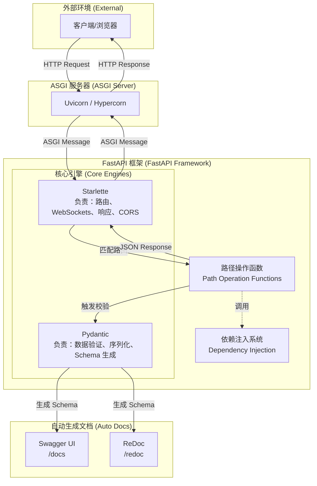

# 并发与 Web 服务 (Web & Service)--FastAPI 框架

- [并发与 Web 服务 (Web \& Service)--FastAPI 框架](#并发与-web-服务-web--service--fastapi-框架)
  - [1 FastAPI 核心架构](#1-fastapi-核心架构)
    - [架构层级详解](#架构层级详解)
  - [2 请求处理全流程](#2-请求处理全流程)
  - [3 核心组件](#3-核心组件)
  - [4 异步并发机制](#4-异步并发机制)
    - [4.1 核心概念](#41-核心概念)
    - [4.2 运行原理](#42-运行原理)
    - [4.3 性能优化的底层支持](#43-性能优化的底层支持)
  - [5 lifespan](#5-lifespan)
    - [5.1 核心定义与设计哲学](#51-核心定义与设计哲学)
    - [5.2 工作原理与执行流程](#52-工作原理与执行流程)
    - [5.3 工程化实现](#53-工程化实现)
    - [5.4 为什么推荐 Lifespan 而非 Legacy Events？](#54-为什么推荐-lifespan-而非-legacy-events)
    - [5.5 应用场景](#55-应用场景)
  - [6 BackgroundTasks（后台任务）](#6-backgroundtasks后台任务)
    - [6.1 基本概述](#61-基本概述)
    - [6.2 运行机制](#62-运行机制)
    - [6.3 工程化实现步骤](#63-工程化实现步骤)
    - [6.4 适用场景](#64-适用场景)
  - [7 CORSMiddleware](#7-corsmiddleware)
    - [7.1 架构定位：属于 Web 支撑层 (Starlette)](#71-架构定位属于-web-支撑层-starlette)
    - [7.2 核心机制](#72-核心机制)
    - [7.3 关键配置参数](#73-关键配置参数)
    - [7.4 工程化实现流程](#74-工程化实现流程)

FastAPI 是一个用于构建 API 的现代、快速（高性能）的 Web 框架。它基于标准的 Python 类型提示（Type Hints） 构建。

核心优势：
- **高性能**：可与 NodeJS 和 Go 并肩，是目前最快的 Python 框架之一。
- **高效率**：开发速度可提升约 200% 至 300%，并能减少约 40% 的人为开发错误。
- **标准化**：完全兼容 OpenAPI（原 Swagger）和 JSON Schema 开放标准。

[fastapi_demo](../codes/python_base/app/ws/fastapi_demo.py)

## 1 FastAPI 核心架构


- FastAPI 的成功在于其“站在巨人的肩膀上”，它主要依赖于两个核心库：``Starlette、Pydantic``。

### 架构层级详解

**1> 运行环境层 (Uvicorn)**

- 作为底层的 ASGI 服务器，它是 FastAPI 应用的运行载体，支持 async/await 异步特性，确保了极高的并发处理能力。
- ``Uvicorn`` 是最常用的选择，它负责监听网络端口，**接收原始的 HTTP 请求** 并将其 **转化** 为应用可以理解的 **ASGI 消息**。

**2> Web 支撑层 (Starlette)**

- FastAPI 建立在 Starlette（执行引擎）之上，负责所有的 Web 核心功能。
- 它的职责包括：管理路由（将 URL 映射到对应的函数）、处理请求和响应、WebSockets 支持、管理 CORS（跨域） 等。


**3> 数据支持层 (Pydantic)**

- 负责所有的数据处理功能，涵盖数据验证、序列化以及基于 Python 类型提示的模式声明。
- 其核心验证逻辑由 Rust 编写，这使得 FastAPI 成为最快的 Python 框架之一


**4> 接口契约层 (OpenAPI & Schema)**

- 通过一次参数声明，FastAPI 会自动生成 JSON Schema。
- 这些 Schema 直接驱动了自动生成的交互式文档：Swagger UI 和 ReDoc。

## 2 请求处理全流程


当一个 HTTP 请求到达 FastAPI 应用时，其内部流程如下：
- **路由匹配**：Uvicorn 接收请求并交给 FastAPI，FastAPI 根据路径和 HTTP 方法寻找对应的处理函数。
- **依赖解析**：执行函数前，先解析并运行该接口依赖的所有子项（如检查登录状态）。
- **提取与校验**：从请求中提取数据，通过 Pydantic 进行类型校验和强制转换。
- **业务执行**：运行开发者编写的函数体逻辑。
- **输出序列化**：将函数返回的 Python 对象（或模型、数据库对象）自动转换为标准的 JSON 数据，并校验响应是否符合预期的响应模型。
- **返回响应**：通过 ASGI 接口将结果返回给客户端。


## 3 核心组件 
FastAPI 的工作原理可以用 **“声明式驱动”** 来概括。

- ``FastAPI`` 类：应用的主入口，用于配置元数据、挂载路由等。
- ``APIRouter``：用于构建大型应用时进行路由分块管理。
- ``Pydantic`` 模型 (BaseModel)：定义请求和响应的数据结构。
- ``Depends`` (依赖注入系统)：通过 Depends() 轻松地实现逻辑复用（如数据库连接、安全认证 OAuth2/JWT），并将这些逻辑解耦到独立的函数或类中。

- ``FastAPI CLI``：提供命令行工具（如 fastapi dev）用于开发和部署。

## 4 异步并发机制
异步并发机制的**原理**：当程序遇到耗时的 I/O 操作（如等待网络返回）时，通过 await 挂起当前任务，将 CPU 控制权交还给事件循环 (Event Loop)，去处理其他任务，从而实现非阻塞并发 。

[asyncio_demo](../codes/python_base/app/ws/asyncio_demo.py)

### 4.1 核心概念
- ``asyncio`` ：处理高并发 I/O 密集型任务的核心标准库。它利用“非阻塞”机制，让程序在等待网络响应或磁盘读写时，能够“转身”去处理其他任务，从而极大地提升系统吞吐量。
- **非阻塞执行**：与传统的同步阻塞模式不同，异步模式下，当程序发起一个耗时操作时，不需要原地等待服务器返回响应，而是可以立即释放 CPU 去处理其他任务。
- **协程**：通过 async def 声明的函数被称为协程函数。当调用它时，它不会立即执行函数体，而是返回一个协程对象。

### 4.2 运行原理
**1> 事件循环 (Event Loop)**
- ``asyncio`` 本质上是一个**无限循环**，它持续监控注册在其上的所有任务状态。当在 main() 中调用 asyncio.gather 时，任务被加入队列，指挥官开始调度执行。

**2> 协程挂起与控制权交还**
- 异步模式：执行到 ``await`` 时，协程会保存当前的局部变量和运行状态，并主动挂起。此时，控制权被交还给**事件循环**，它发现“用户服务”在等网络，于是立即安排 CPU 去执行“订单服务”的任务。
- 相对于异步模式，传统的同步模式，执行到 time.sleep(3) 时，整个线程被锁定，CPU 必须原地等待 3 秒才能走下一行代码。

**3> 协程切换 (Coroutine Switching)**
- 在单个线程内，允许在等待网络响应（如通过 httpx 发起请求）时，释放 CPU 并切换处理其他任务的能力被称为**协程切换**。
- 它不像多线程切换那样需要昂贵的操作系统内核参与，因此切换极其轻量，这正是 FastAPI 能够承载海量并发连接的底层秘密。

### 4.3 性能优化的底层支持
- **uvloop**：在高性能生产环境下，Uvicorn 可以包含 uvloop 依赖，这是对 Python 标准事件循环的极速替代方案，能显著提升并发处理能力。
- **生态协同**：现代库如 httpx 提供了异步客户端（AsyncClient），允许在测试和生产中像处理普通代码一样优雅地处理高并发网络请求。


## 5 lifespan
lifespan 是现代 FastAPI 开发中管理应用生命周期事件（启动与关闭）的标准方式。它取代了早期版本中零散的 startup 和 shutdown 事件，提供了一种更简洁、更符合 Python 惯例（即 上下文管理协议）的资源管理模式。

### 5.1 核心定义与设计哲学
Lifespan 本质上是一个 **异步上下文管理器**。它利用了 Python 生成器的 “暂停与恢复” 机制，将应用启动前后的逻辑封装在一个函数内。

- ``Startup``（启动时）：在 yield 关键字之前的代码。这部分逻辑在应用开始接收请求之前执行，常用于初始化数据库连接池、加载大模型权重等**耗时操作**。
- ``Shutdown``（关闭时）：在 yield 关键字之后的代码。这部分逻辑在应用停止接收请求、准备关闭之后执行，确保资源（如数据库连接、文件句柄）被安全释放。

### 5.2 工作原理与执行流程
Lifespan 的工作流程可以拆解为以下阶段：

- **进入上下文**：Uvicorn 启动应用时，首先调用 `lifespan` 函数，执行 `yield` 前的逻辑。
- **挂起状态**：程序运行到 ``yield`` 时会“暂停”，此时应用正式进入运行状态，开始通过 ASGI 接口处理 HTTP 请求。
- **恢复执行**：当应用收到关闭信号（如 Ctrl+C）后，事件循环会恢复 `lifespan` 函数的执行。
- **清理资源**：执行 yield 之后的逻辑（通常放在 finally 块中），完成资源回收。

### 5.3 工程化实现
实现 lifespan 通常遵循以下结构：

- **定义 `Lifespan` 函数**：使用 `@asynccontextmanager` 装饰一个异步生成器函数。
- **注册到应用**：在创建 FastAPI 实例时，通过 lifespan 参数将其传入。

```python
from contextlib import asynccontextmanager
from fastapi import FastAPI

@asynccontextmanager
async def lifespan(app: FastAPI):
    # 【启动时逻辑】
    # 例如：db_pool = await connect_to_db()
    print("应用启动：正在初始化资源...")
    yield  # 应用在此处运行并接收请求
    # 【关闭时逻辑】
    # 例如：await db_pool.close()
    print("应用关闭：正在释放资源...")

app = FastAPI(lifespan=lifespan)
```

### 5.4 为什么推荐 Lifespan 而非 Legacy Events？

- **资源共享与状态传递**：通过 yield 之前的逻辑，你可以将初始化好的对象（如数据库连接）存入 app.state 中，使得所有路由函数都能通过 request.app.state 访问这些资源。
  
- **健壮的异常处理**：由于它使用了标准的 ``try...finally`` 结构，即使启动过程中发生异常，也能确保清理逻辑被触发，防止资源泄露。

- **统一的逻辑视图**：将“开启”与“关闭”逻辑放在同一个函数内，符合“代码与配置分离”以及逻辑内聚的工程原则，增加了代码的可读性。

### 5.5 应用场景
- **AI/ML 应用**：在启动时加载大模型到内存或 GPU 显存中，避免在接口调用时重复加载导致的高延迟。
- **数据库连接池**：在应用级别维护一个全局的数据库连接池（如 SQLAlchemy 或 Redis），提高高并发下的响应速度。
- **定时任务初始化**：在应用启动时启动后台调度任务，在关闭时优雅地停止它们。

## 6 BackgroundTasks（后台任务）
BackgroundTasks 是**处理耗时逻辑而不阻塞客户端请求**的关键组件。它允许你返回一个 HTTP 响应后，让服务器在后台继续执行特定的函数。

### 6.1 基本概述
BackgroundTasks 是由 FastAPI 提供的一个工具类，旨在解决 “即时响应 vs 耗时处理” 的矛盾。

- **非阻塞响应**：在 Web API 视角下，客户端（如手机 App 或浏览器）发起请求后，通常希望尽快得到结果。对于发送邮件、处理图像、或写入复杂审计日志等耗时操作，如果放在主逻辑中执行，会导致客户端长时间挂起。
- **执行契约**：使用后台任务时，FastAPI 会在生成 HTTP 响应并将其发送回客户端后，立即启动该后台函数。

lifespan 和 BackgroundTasks 的区别与联系：
- lifespan 管理整个应用的启动与关闭资源，BackgroundTasks 管理单个 HTTP 请求结束后触发的异步动作；二者共同完善了 FastAPI 在不同维度下的资源和任务调度体系。

### 6.2 运行机制
后台任务的运行机制深度依赖于 FastAPI 的核心架构：

- **基于 `Starlette`**：后台任务的底层逻辑由 Starlette 提供，FastAPI 将其封装为易用的类。
- **异步并发驱动**：后台任务利用了 Python 的协程（asyncio）或线程池机制。
  - 如果后台任务是 async def 函数，它将在事件循环（Event Loop）中以非阻塞方式运行；
  - 如果是普通 def 函数，则在内部线程池中运行。
- **生命周期衔接**：在请求处理流程中，后台任务发生在“响应生成”之后，属于请求周期的最后延伸。

### 6.3 工程化实现步骤
后台任务通常遵循以下声明式模式：

- **定义任务函数**：创建一个普通的函数，它可以是同步的也可以是异步的。
- **注入依赖参数**：在路径操作函数（Path Operation Function）中声明一个类型为 `BackgroundTasks` 的参数。
- **注册任务**：调用 `background_tasks.add_task()` 方法，将函数名及其参数传入。

```python
from fastapi import FastAPI, BackgroundTasks

app = FastAPI()

def write_log(message: str):
    # 模拟耗时的 IO 操作，如写入日志文件 [10]
    with open("log.txt", mode="a") as log:
        log.write(message)

@app.post("/send-notification/{email}")
async def send_notification(email: str, background_tasks: BackgroundTasks):
    # 1. 执行即时业务逻辑
    # 2. 注册后台任务
    background_tasks.add_task(write_log, f"notification sent to {email}")
    # 3. 立即返回响应给客户端
    return {"message": "Notification sent in the background"}
```

### 6.4 适用场景
- **邮件/消息推送**：用户注册后，立即跳转页面，后台再慢慢发送验证码邮件。
- **大数据处理/离线备份**：在文件读写和 CSV 导出中，如果是针对海量数据，非常适合放在后台处理。
- **大模型调用链路追踪**：对于非核心的性能统计日志，可以考虑通过后台任务异步写入磁盘。


## 7 CORSMiddleware
CORSMiddleware 是解决前后端分离架构中 **“跨域资源共享”**（Cross-Origin Resource Sharing）问题的核心组件。

### 7.1 架构定位：属于 Web 支撑层 (Starlette)
FastAPI 的成功建立在 Starlette 这一执行引擎之上，而 管理跨域 (CORS) 正是 Starlette 层级的主要职责之一。

- 在 FastAPI 的四层架构中，CORS 处理位于 **中间层（Web 支撑层）**，负责在请求到达业务逻辑函数之前，先处理网络协议层面的安全校验。
- 它确保了应用能够安全地与运行在不同域名或端口上的前端应用进行通信。

### 7.2 核心机制
CORS 是一种基于 HTTP 头的机制，用于解决**浏览器的“同源策略”限制**。

- **打破同源限制**：默认情况下，浏览器出于安全考虑，禁止一个域（Origin）的网页向另一个域发送 AJAX 请求。CORSMiddleware 允许开发者声明哪些外部域可以访问该 API。
- **中间件机制**：它作为“中间件”运行，意味着它会拦截每一个进入应用的请求。如果是一个跨域请求，它会检查该请求是否符合预设的安全规则。

### 7.3 关键配置参数
- `allow_origins`（允许的源）：
  - 定义哪些域名、协议或端口（如 http://localhost:3000）有权访问后端。
  - 在开发环境下有时会使用 ["*"] 允许所有源，但在生产环境中出于安全考虑，必须显式指定具体的域名。

- `allow_credentials`（允许凭证）：指定跨域请求是否支持 Cookie 或身份验证信息。

- `allow_methods`（允许的方法）：定义允许跨域访问的 HTTP 方法，如 GET、POST、PUT、DELETE 等。

- `allow_headers`（允许的头部）：定义允许客户端在请求中携带的自定义 HTTP 头部信息。

### 7.4 工程化实现流程
实现 CORS 配置通常遵循以下代码模式（注：以下具体实现步骤为根据 FastAPI 官方推荐的标准工程实践进行的补充说明）：

- **导入模块**：从 `fastapi.middleware.cors` 导入 `CORSMiddleware`。
- **添加中间件**：使用 `app.add_middleware()` 方法将其实例化并挂载到应用上。
- **定义规则**：传入上述的 Origins、Methods 等参数。

```python
from fastapi import FastAPI
from fastapi.middleware.cors import CORSMiddleware

app = FastAPI()

# 声明允许的源列表
origins = [
    "http://localhost:3000",
    "https://example.com",
]

app.add_middleware(
    CORSMiddleware,
    allow_origins=origins,
    allow_credentials=True,
    allow_methods=["*"],
    allow_headers=["*"],
)
```


