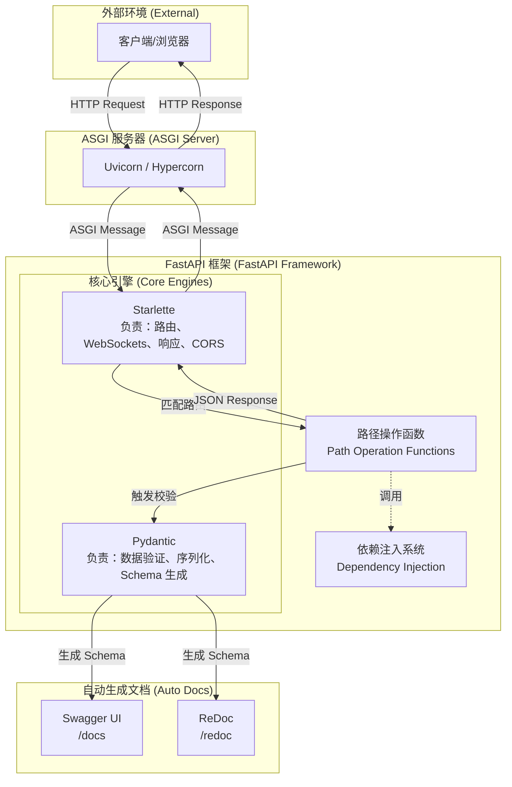

# 并发与 Web 服务 (Web & Service)--FastAPI 框架

- [并发与 Web 服务 (Web \& Service)--FastAPI 框架](#并发与-web-服务-web--service--fastapi-框架)
  - [1 FastAPI 核心架构](#1-fastapi-核心架构)
    - [架构层级详解](#架构层级详解)
  - [2 请求处理全流程](#2-请求处理全流程)
  - [3 核心组件](#3-核心组件)
  - [4 异步并发机制](#4-异步并发机制)
    - [4.1 核心概念](#41-核心概念)
    - [4.2 运行原理](#42-运行原理)
    - [4.3 性能优化的底层支持](#43-性能优化的底层支持)
  - [5 适用场景](#5-适用场景)

FastAPI 是一个用于构建 API 的现代、快速（高性能）的 Web 框架。它基于标准的 Python 类型提示（Type Hints） 构建。

核心优势：
- **高性能**：可与 NodeJS 和 Go 并肩，是目前最快的 Python 框架之一。
- **高效率**：开发速度可提升约 200% 至 300%，并能减少约 40% 的人为开发错误。
- **标准化**：完全兼容 OpenAPI（原 Swagger）和 JSON Schema 开放标准。

[fastapi_demo](../codes/python_base/app/ws/fastapi_demo.py)

## 1 FastAPI 核心架构

- FastAPI 的成功在于其“站在巨人的肩膀上”，它主要依赖于两个核心库：``Starlette、Pydantic``。

### 架构层级详解

**1> 运行环境层 (Uvicorn)**

- 作为底层的 ASGI 服务器，它是 FastAPI 应用的运行载体，支持 async/await 异步特性，确保了极高的并发处理能力。
- ``Uvicorn`` 是最常用的选择，它负责监听网络端口，**接收原始的 HTTP 请求** 并将其 **转化** 为应用可以理解的 **ASGI 消息**。

**2> Web 支撑层 (Starlette)**

- FastAPI 建立在 Starlette（执行引擎）之上，负责所有的 Web 核心功能。
- 它的职责包括：管理路由（将 URL 映射到对应的函数）、处理请求和响应、WebSockets 支持、管理 CORS（跨域） 等。

**3> 数据支持层 (Pydantic)**

- 负责所有的数据处理功能，涵盖数据验证、序列化以及基于 Python 类型提示的模式声明。
- 其核心验证逻辑由 Rust 编写，这使得 FastAPI 成为最快的 Python 框架之一

**4> 接口契约层 (OpenAPI & Schema)**

- 通过一次参数声明，FastAPI 会自动生成 JSON Schema。
- 这些 Schema 直接驱动了自动生成的交互式文档：Swagger UI 和 ReDoc。

## 2 请求处理全流程

当一个 HTTP 请求到达 FastAPI 应用时，其内部流程如下：
- **路由匹配**：Uvicorn 接收请求并交给 FastAPI，FastAPI 根据路径和 HTTP 方法寻找对应的处理函数。
- **依赖解析**：执行函数前，先解析并运行该接口依赖的所有子项（如检查登录状态）。
- **提取与校验**：从请求中提取数据，通过 Pydantic 进行类型校验和强制转换。
- **业务执行**：运行开发者编写的函数体逻辑。
- **输出序列化**：将函数返回的 Python 对象（或模型、数据库对象）自动转换为标准的 JSON 数据，并校验响应是否符合预期的响应模型。
- **返回响应**：通过 ASGI 接口将结果返回给客户端。

## 3 核心组件 
FastAPI 的工作原理可以用 **“声明式驱动”** 来概括。

- ``FastAPI`` 类：应用的主入口，用于配置元数据、挂载路由等。
- ``APIRouter``：用于构建大型应用时进行路由分块管理。
- ``Pydantic`` 模型 (BaseModel)：定义请求和响应的数据结构。
- ``Depends`` (依赖注入系统)：通过 Depends() 轻松地实现逻辑复用（如数据库连接、安全认证 OAuth2/JWT），并将这些逻辑解耦到独立的函数或类中。

- ``FastAPI CLI``：提供命令行工具（如 fastapi dev）用于开发和部署。

## 4 异步并发机制
异步并发机制的**原理**：当程序遇到耗时的 I/O 操作（如等待网络返回）时，通过 await 挂起当前任务，将 CPU 控制权交还给事件循环 (Event Loop)，去处理其他任务，从而实现非阻塞并发 。

[asyncio_demo](../codes/python_base/app/ws/asyncio_demo.py)

### 4.1 核心概念
- ``asyncio`` ：处理高并发 I/O 密集型任务的核心标准库。它利用“非阻塞”机制，让程序在等待网络响应或磁盘读写时，能够“转身”去处理其他任务，从而极大地提升系统吞吐量。
- **非阻塞执行**：与传统的同步阻塞模式不同，异步模式下，当程序发起一个耗时操作时，不需要原地等待服务器返回响应，而是可以立即释放 CPU 去处理其他任务。
- **协程**：通过 async def 声明的函数被称为协程函数。当调用它时，它不会立即执行函数体，而是返回一个协程对象。

### 4.2 运行原理
**1> 事件循环 (Event Loop)**
- ``asyncio`` 本质上是一个**无限循环**，它持续监控注册在其上的所有任务状态。当在 main() 中调用 asyncio.gather 时，任务被加入队列，指挥官开始调度执行。

**2> 协程挂起与控制权交还**
- 异步模式：执行到 ``await`` 时，协程会保存当前的局部变量和运行状态，并主动挂起。此时，控制权被交还给**事件循环**，它发现“用户服务”在等网络，于是立即安排 CPU 去执行“订单服务”的任务。
- 相对于异步模式，传统的同步模式，执行到 time.sleep(3) 时，整个线程被锁定，CPU 必须原地等待 3 秒才能走下一行代码。

**3> 协程切换 (Coroutine Switching)**
- 在单个线程内，允许在等待网络响应（如通过 httpx 发起请求）时，释放 CPU 并切换处理其他任务的能力被称为**协程切换**。
- 它不像多线程切换那样需要昂贵的操作系统内核参与，因此切换极其轻量，这正是 FastAPI 能够承载海量并发连接的底层秘密。

### 4.3 性能优化的底层支持
- **uvloop**：在高性能生产环境下，Uvicorn 可以包含 uvloop 依赖，这是对 Python 标准事件循环的极速替代方案，能显著提升并发处理能力。
- **生态协同**：现代库如 httpx 提供了异步客户端（AsyncClient），允许在测试和生产中像处理普通代码一样优雅地处理高并发网络请求。

## 5 适用场景
FastAPI 已被多家顶级科技公司用于生产环境：
- **机器学习 (ML) 服务**：微软计划将其用于核心产品中的 ML 服务集成。
- **高性能数据服务器**：Uber 使用它启动 REST 服务器以查询预测结果。
- **危机管理系统**：Netflix 使用其构建危机管理编排框架 Dispatch。
- **生产级 API 优先战略**：思科 (Cisco) 将其作为 API 开发的关键组件。

