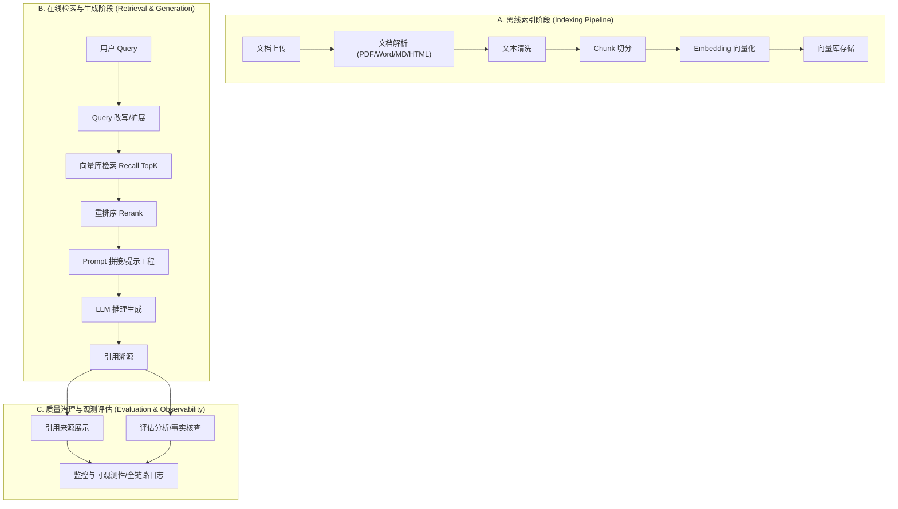

# 模块1：RAG 基本原理与架构

## 1 RAG 基本概念

### 1.1 什么是 RAG
RAG（Retrieval-Augmented Generation，检索增强生成）是一种将外部知识库（如私有文档、行业数据）与 **大语言模型（LLM）** 内置知识相结合的技术。通过在生成答案之前，先从语料库中检索出相关的上下文信息，从而增强模型生成内容的准确性和可靠性。

### 1.2 RAG 解决了什么问题
RAG 主要针对 LLM 在实际应用中的三大痛点：

- **信息滞后**：解决模型训练数据存在截止日期，无法掌握最新实时信息的问题。
- **模型幻觉**：通过提供确凿的外部上下文，减少模型“一本正经胡说八道”的情况。
- **行业/私有数据隔离**：LLM 无法学习到企业内部或特定行业的私有文档，RAG 可以动态接入这些数据而无需重新训练模型。

### 1.3 RAG 和微调（Fine-tuning）的区别
两者是优化大模型表现的两种不同路径：

- **工作原理**：
    - 微调是通过在新数据集上重新训练来**更新模型的内部权重**；
    - 而 RAG 不改变模型，只是在输入中提供实时检索到的**外部上下文**。
- **灵活性与更新**：RAG 更加灵活，只需更新外部知识库即可实现知识同步；微调则需要昂贵的重新训练过程。
- **适用场景**：微调更适合调整模型的**语气、格式或特定任务的执行能力**；RAG 更适合需要**动态更新事实知识**的问答场景。

### 1.4 RAG 为什么会产生幻觉
即便使用了 RAG，幻觉依然可能发生，原因通常包括：

- **检索失败**：模型所需的正确信息并未出现在检索到的 TopK 片段中。
- **上下文矛盾**：检索到的多个片段之间存在信息冲突，或与模型内置知识冲突，导致模型推理错误。
- **噪声干扰**：检索回来的内容包含大量无关信息，分散了模型的注意力。
- **生成能力限制**：模型虽然拿到了正确上下文，但无法准确提取或理解其中的事实。

### 1.5 RAG 的应用场景

#### 1> 智能问答与客户服务
目前 RAG 应用最成熟、广泛的领域。
    
- **在线自助产品咨询** ：例如，当客户询问某款新手机与竞品的区别时，系统能实时从私有知识库中检索最新参数并生成准确回答，避免模型因训练数据过时而编造信息。
- **智能客服与在线咨询**：在企业级应用中，RAG 被用于构建智能助手，处理客户投诉、方案咨询等任务。

#### 2> 企业内部知识检索与管理
企业内部存在海量的 PDF、Word、Excel 及数据库记录。RAG 允许员工通过自然语言精准搜索内部文档、管理制度或技术手册。

#### 3> 数据分析与交互式查询
- **交互式数据分析**：用户可以通过自然语言与数据库交互。
- **Text-to-SQL 增强**：在将自然语言转换为 SQL 语句的过程中，利用 RAG 向 Prompt 中注入检索到的表结构描述信息，从而显著提升 SQL 生成的准确性。

#### 4> AI 智能体的支撑架构
RAG 不仅是一个独立的应用形态，它也是开发复杂 AI 智能体（AI Agent）的核心组件。

- **工具与插件选择**：当 Agent 面对海量工具时，可以利用 RAG 的思想（对象索引）动态检索并选择当前任务最需要的工具，降低推理复杂度。
- **长期记忆实现**：RAG 为智能体提供了模拟长期记忆的能力，使其能够调取历史交互中的关键信息来辅助决策。

#### 5> 专业垂直领域应用
在医疗、法律等对准确性要求极高的行业，RAG 被用于辅助医疗诊断或法律咨询。

## 2 RAG 工作流程
从“企业知识库系统”的角度，RAG（检索增强生成）可以被视作一套标准的数据处理与在线推理管线。

### 2.1 索引链路（离线预处理阶段）
负责将非结构化文档转化为机器可检索的结构化向量数据。

- 1> **文档解析 (Document Loader/Parser)**
    
    用专门的加载器（如 PyPDFLoader 解析 PDF，WebBaseLoader 解析 HTML）将原始文件（PDF、Word、HTML 等）转换为标准化的文档对象。对于复杂排版或含图表的文档，可使用 LlamaParse 等具备 OCR 能力的工具进行深度解析。

- 2> **文本清洗与切分 (Text Splitter)**

    清洗掉网页导航、无关样式等噪点。由于模型上下文窗口有限且为了提升向量检索精度，通常使用 RecursiveCharacterTextSplitter 将文本切分为 500-1000 字符的小块（Chunk），并设置重叠（Overlap）以保持语义连续。

- 3> **Embedding 向量化**

    调用模型 API（如OpenAI 的 text-embedding-3 系列模型）将文本 Chunk 转换为高维数值向量（语义指纹）。

- 4> **向量库存储 (Vector Store)**

    持久化向量数据到向量数据库（如Chroma、Pinecone、FAISS），并构建 HNSW 等高效索引以支持语义搜索。

### 2.2 检索链路（在线运行阶段）
用户提问时的实时处理流程。

- 0> **Query 改写**
    
    当原始 Query 模糊或简短时（看一句话语义不清晰），通过 MultiQueryRetriever 利用 LLM 生成多个语义相似的变体，提升召回相关文档的概率。

- 1> **检索 (Retriever)**
    
    根据用户问题的向量，在向量库中执行相似度搜索，召回 TopK 个最相关的 Chunk。

    - Query 改写和检索的区别与联系：
    
        - Query 改写负责把话问清楚、问对；
        - 检索根据确定的问题，把东西找出来。 

- 2> **重排序 (Reranker)**

    利用精细模型对初筛的 TopK 结果进行二次打分，确保最相关的核心信息排在首位。

    - **召回、重排序的逻辑关系**：
        
        - **召回**：从海量文档库中快速筛选出 K 个候选片段。
            - 通常采用**向量相似度搜索**（Dense Retrieval）或**关键词搜索**（Sparse Retrieval，如 BM25），在**毫秒级**内完成计算。

        - **重排序**：对召回的初步结果进行精细化的相关性评估，重新排列它们的顺序；追求精度。
            - 通常用更复杂的模型（如 Cross-Encoder），它能更深层地理解 Query 与文档之间的语义匹配，但计算开销大，无法处理全量数据。
        - 他们的协作逻辑是：召回（粗筛）-->重排序（精滤）-->最终交付，是效率和精度的权衡。

- 3> **Prompt 拼接与生成**

    将检索出的 TopK 片段作为 Context 与用户 Query 填入 Prompt 模版，请求 LLM 生成答案。

- 4> **引用溯源**
    
    在生成的回答中标注来源（如：来自某文档第 X 页）。

### 2.3 质量治理（监控与评估）

- 1> **评估(Evaluation Pipeline)**
    
    量化 RAG 系统的性能。常用 **RAGAS 框架的“三元组”指标**：
    - **上下文相关性**：检索得准不准。
    - **忠实度**：回答是否完全基于上下文（防止幻觉）。
    - **答案相关性**：是否答非所问。

- 2> **监控与可观测性 (Observability)**

    利用 LangSmith 或 Phoenix 等工具记录全链路 Trace，将 Query 到生成的全过程构建为因果追踪图，快速定位是 “检索没找对” 还是 “LLM 没理解对”。

## 3 生产级工程落地与系统治理
重点在于系统的稳定性、安全性、成本控制及“代理化”演进。

- **1> 工程性能优化**：
  - **语义缓存**（Semantic Caching）：对相似请求重用结果，降低 API 成本（最高达65%）并提升响应速度。
  - **模型路由**（Model Routing）：简单问题走低成本模型，复杂推理走 Frontier 模型，实现性能与成本平衡。
  - **异步处理**：利用 `asyncio` 提升系统并发吞吐量（可提升10-20倍）。

- **2> 安全性与合规**：
  - **防御提示词注入**：防止通过用户输入操控系统行为。
  - **隐私保护**：PII（个人识别信息）检测与脱敏，防止向量库或响应中泄露敏感数据。

- **智能体 RAG**（Agentic RAG）:
  - **自纠错循环**：使用 LangGraph 等框架，让 Agent 决定是否需要检索、评估检索质量，并在质量不达标时自动改写 Query 重新尝试。

- **全链路可观测性**：
  - **链路追踪**（Tracing）：利用 LangSmith 或 Phoenix 对每个步骤（查询、嵌入、检索、生成）进行时长和质量监控。

- **行业最佳实践**：
  - **LCEL**（LangChain 表达式语言）：使用声明式语法构建灵活、可组合且版本无关的 Pipeline。
  - **结构化输出**：使用 Pydantic 强制模型返回 JSON 或指定模式，方便后端系统集成。

