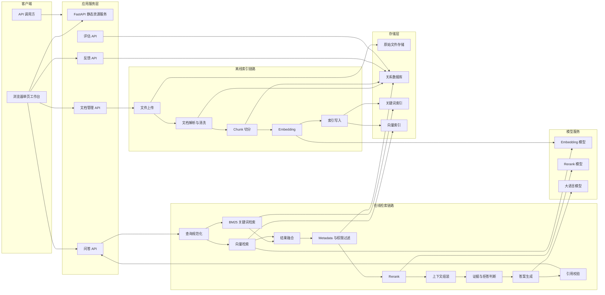
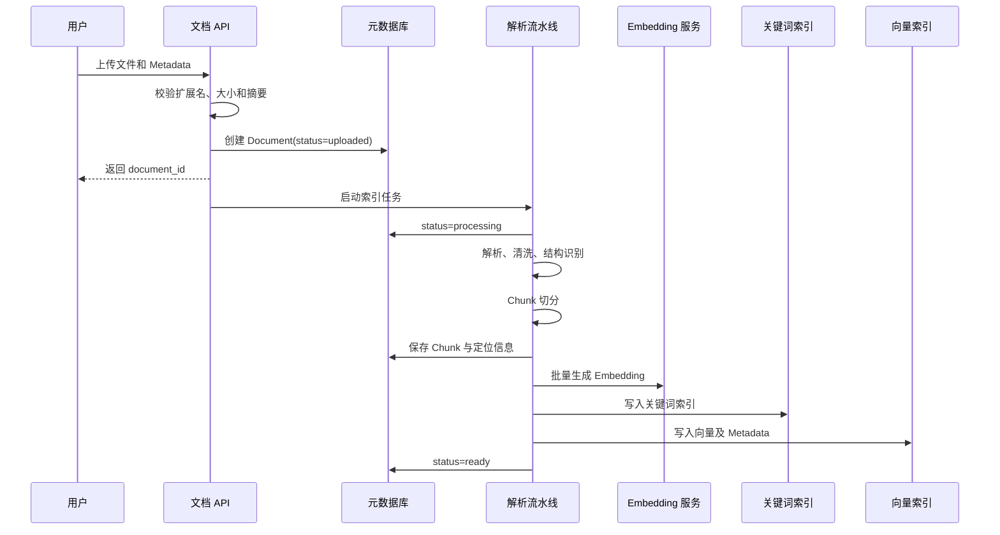
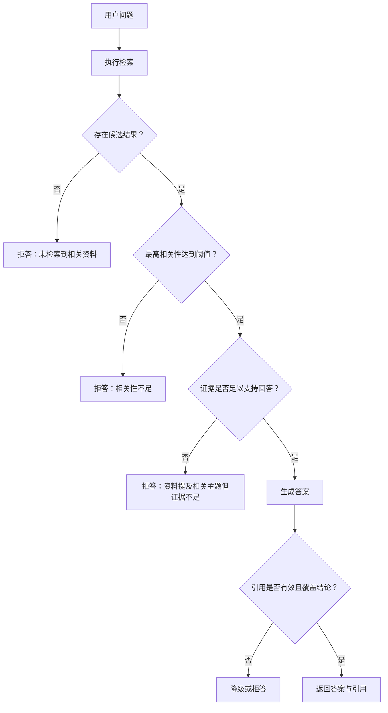

# rag-knowledge-engine 技术架构文档

## 1. 文档概述

### 1.1 项目目标

构建一个面向企业知识库的 RAG（Retrieval-Augmented Generation，检索增强生成）问答系统，支持：

- 上传 PDF、Word、Excel、Markdown 文件
- 解析、清洗和切分文档
- 构建关键词索引与向量索引
- 执行 Hybrid Search、Metadata Filter 和 Rerank
- 基于检索上下文生成答案
- 输出可追溯的引用来源
- 在证据不足时拒绝回答
- 收集用户反馈
- 对检索与生成效果进行评估

项目同时承担教学目标：每个阶段都应能独立运行、测试和观察，使开发者能够理解完整的 RAG 数据链路。

### 1.2 核心原则

1. **证据优先**：答案必须来自检索到的企业资料。
2. **可追溯**：答案中的事实能够定位到原文及页码、工作表或章节。
3. **可拒答**：知识库没有充分证据时，不依赖模型自由发挥。
4. **可评估**：检索和生成质量必须能够量化。
5. **模块化**：解析器、Embedding、向量库、Reranker 和 LLM 均可替换。
6. **可观测**：一次问答的查询、召回、排序、上下文和生成过程可追踪。
7. **安全隔离**：检索时必须执行权限和租户过滤，不能只依赖提示词。

## 2. 系统边界

### 2.1 系统内能力

系统负责：

- 文档生命周期管理
- 原始文件存储
- 文档解析与标准化
- Chunk 构建
- Embedding 生成
- 关键词及向量索引维护
- 检索、融合、过滤和重排
- Prompt 与上下文组装
- 答案生成、引用和拒答
- 用户反馈及 RAG 评估

### 2.2 暂不纳入第一版

第一版暂不重点建设：

- OCR 扫描件识别
- 图片、图表的多模态理解
- 复杂表格语义重建
- 企业级 SSO
- 多知识库权限继承
- 分布式任务调度
- 超大规模索引分片
- Agent 工具调用

架构会预留这些扩展点。

## 3. 总体架构

系统采用模块化单体架构，由同一个 FastAPI 应用同时提供静态页面和后端 API，不进行前后端分离。业务处理分为两条核心链路：

- **离线索引链路**：文件上传后经过解析、切分、向量化并写入索引。
- **在线问答链路**：用户问题经过检索、融合、重排和上下文组装后交给 LLM。



## 4. 技术栈建议

| 领域 | 第一阶段建议 | 架构说明 |
|---|---|---|
| 编程语言 | Python 3.11+ | RAG 生态成熟，文档处理库丰富 |
| API 框架 | FastAPI | 异步 API、类型约束和 OpenAPI 支持良好 |
| 数据校验 | Pydantic | 定义 API、领域对象和配置模型 |
| 关系数据库 | SQLite，生产可切换 PostgreSQL | 保存文档、Chunk、任务、反馈及评估数据 |
| 原始文件存储 | 本地文件系统，生产可切换对象存储 | 接口抽象后可替换为 S3/MinIO |
| 关键词检索 | BM25 | 教学版可本地实现，生产可切换 Elasticsearch/OpenSearch |
| 向量索引 | Qdrant 或本地向量索引 | 支持向量查询和 Metadata Filter |
| Embedding | OpenAI-compatible 接口 | 通过适配器支持不同厂商或本地模型 |
| Rerank | Cross-Encoder 或外部 Rerank API | 对初步召回结果进行语义精排 |
| LLM | OpenAI-compatible Chat API | 避免业务代码绑定具体模型 |
| 后台任务 | 第一版进程内任务，后续切换任务队列 | 索引构建与在线问答解耦 |
| 测试 | pytest | 单元、集成和端到端测试 |
| 前端 | 原生 HTML、CSS、JavaScript | 简洁单页工作台，无 Node.js 和前端构建步骤 |
| 页面托管 | FastAPI `StaticFiles`、`FileResponse` | 同一进程、同一域名提供页面和 API |
| 可观测性 | 结构化日志、Trace ID、指标 | 记录 RAG 每个阶段的耗时和结果 |

建议业务代码不直接依赖 LangChain、LlamaIndex 等上层框架。可以在适配层使用它们，但核心领域对象和检索流程由项目自身维护，以便真正理解 RAG 的内部机制。

## 5. 分层设计

### 5.1 API 层

负责：

- HTTP 请求解析
- 身份及权限上下文提取
- 参数校验
- 调用应用服务
- 统一错误响应
- 流式答案输出

不负责：

- 直接访问向量库
- 拼接 Prompt
- 实现检索算法
- 处理文档格式细节

### 5.2 Application 应用层

负责编排用例：

- 上传文档
- 构建或重建索引
- 删除文档及其索引
- 执行知识库问答
- 提交用户反馈
- 运行评估任务

这一层定义事务边界和流程，但不绑定具体存储或模型。

### 5.3 Domain 领域层

包含 RAG 核心概念：

- `Document`
- `DocumentVersion`
- `ParsedDocument`
- `Chunk`
- `Query`
- `RetrievedChunk`
- `SearchResult`
- `Citation`
- `Answer`
- `Feedback`
- `EvaluationCase`

领域层还负责：

- Chunk 标识规则
- 检索结果融合规则
- 上下文预算
- 引用映射
- 拒答决策

### 5.4 Infrastructure 基础设施层

通过接口实现外部能力：

- 文件解析器
- Embedding Provider
- LLM Provider
- Rerank Provider
- Vector Store
- Keyword Index
- Metadata Repository
- Object Store
- 日志和可观测性

### 5.5 静态页面层

项目不采用前后端分离架构。FastAPI 直接托管 `static` 目录，浏览器通过同源 `fetch` 调用 `/api/v1/*` 接口。

页面采用原生 HTML、CSS 和 JavaScript，不引入 React、Vue、Node.js 或打包工具。第一版使用单页工作台，包含：

- 文档管理：文件上传、Metadata 设置、处理状态、重新索引和删除。
- 知识库问答：问题输入、Metadata Filter、答案、拒答状态和引用来源。
- 检索调试：关键词、向量、Hybrid、Rerank 结果及分数对比。
- 反馈与评估：点赞、点踩、原因选择和评估摘要。

页面只负责交互和展示，不实现检索、权限、引用校验等业务规则。所有业务操作必须通过应用 API 完成。

## 6. 推荐项目结构

```text
rag-knowledge-engine/
├── app/
│   ├── api/
│   │   ├── documents.py
│   │   ├── queries.py
│   │   ├── feedback.py
│   │   └── evaluations.py
│   ├── application/
│   │   ├── ingestion_service.py
│   │   ├── retrieval_service.py
│   │   ├── answer_service.py
│   │   └── evaluation_service.py
│   ├── domain/
│   │   ├── models.py
│   │   ├── enums.py
│   │   ├── exceptions.py
│   │   └── policies/
│   ├── ingestion/
│   │   ├── parsers/
│   │   ├── cleaners/
│   │   ├── chunkers/
│   │   └── pipeline.py
│   ├── retrieval/
│   │   ├── keyword.py
│   │   ├── vector.py
│   │   ├── hybrid.py
│   │   ├── filters.py
│   │   ├── fusion.py
│   │   └── reranker.py
│   ├── generation/
│   │   ├── context_builder.py
│   │   ├── prompts.py
│   │   ├── answer_generator.py
│   │   ├── citation_validator.py
│   │   └── refusal_policy.py
│   ├── infrastructure/
│   │   ├── database/
│   │   ├── object_store/
│   │   ├── vector_store/
│   │   ├── search_index/
│   │   └── model_providers/
│   ├── evaluation/
│   │   ├── datasets.py
│   │   ├── retrieval_metrics.py
│   │   ├── generation_metrics.py
│   │   └── runner.py
│   ├── core/
│   │   ├── config.py
│   │   ├── logging.py
│   │   └── security.py
│   └── main.py
├── static/
│   ├── index.html
│   ├── css/
│   │   └── app.css
│   ├── js/
│   │   ├── api.js
│   │   └── app.js
│   └── assets/
├── tests/
│   ├── unit/
│   ├── integration/
│   ├── e2e/
│   └── fixtures/
├── data/
│   ├── uploads/
│   ├── indexes/
│   └── evaluations/
├── scripts/
├── docs/
├── pyproject.toml
├── .env.example
└── README.md
```

## 7. 核心数据模型

### 7.1 Document

表示用户上传的逻辑文档。

| 字段 | 类型 | 说明 |
|---|---|---|
| `id` | UUID | 文档唯一标识 |
| `knowledge_base_id` | UUID | 所属知识库 |
| `name` | string | 展示名称 |
| `file_name` | string | 原始文件名 |
| `file_type` | enum | PDF、DOCX、XLSX、MD |
| `storage_uri` | string | 原始文件位置 |
| `checksum` | string | 文件内容摘要，用于去重 |
| `status` | enum | uploaded、processing、ready、failed |
| `version` | integer | 文档版本 |
| `metadata` | JSON | 业务元数据 |
| `created_by` | string | 上传用户 |
| `created_at` | datetime | 创建时间 |
| `updated_at` | datetime | 更新时间 |

### 7.2 Chunk

Chunk 是检索和引用的最小知识单元。

| 字段 | 类型 | 说明 |
|---|---|---|
| `id` | UUID | 稳定 Chunk ID |
| `document_id` | UUID | 所属文档 |
| `knowledge_base_id` | UUID | 所属知识库 |
| `sequence` | integer | 文档内顺序 |
| `content` | text | 清洗后的正文 |
| `content_hash` | string | 内容摘要 |
| `token_count` | integer | Token 数量 |
| `title` | string | 所属标题 |
| `section_path` | array | 章节层级 |
| `page_start` | integer | 起始页 |
| `page_end` | integer | 结束页 |
| `sheet_name` | string | Excel 工作表名称 |
| `row_start` | integer | Excel 起始行 |
| `row_end` | integer | Excel 结束行 |
| `source_locator` | JSON | 原文定位信息 |
| `metadata` | JSON | 权限、部门、标签等 |
| `embedding_model` | string | Embedding 模型标识 |
| `embedding_version` | string | 向量版本 |

### 7.3 QueryLog

保存一次完整问答过程。

| 字段 | 说明 |
|---|---|
| `query_id` | 一次问答的 Trace ID |
| `user_id` | 请求用户 |
| `knowledge_base_id` | 查询知识库 |
| `question` | 原始问题 |
| `normalized_query` | 规范化后的查询 |
| `filters` | Metadata 和权限过滤条件 |
| `retrieved_chunks` | 初始召回结果和得分 |
| `reranked_chunks` | 重排结果和得分 |
| `context_chunk_ids` | 最终进入上下文的 Chunk |
| `answer` | 最终答案 |
| `citations` | 引用列表 |
| `refused` | 是否拒答 |
| `refusal_reason` | 拒答原因 |
| `latency` | 各阶段耗时 |
| `model_usage` | Token 和模型调用统计 |

### 7.4 Feedback

| 字段 | 说明 |
|---|---|
| `query_id` | 对应问答记录 |
| `rating` | 正向、负向或评分 |
| `reason_codes` | 检索错误、答案错误、引用错误等 |
| `comment` | 用户补充说明 |
| `expected_answer` | 可选的正确答案 |
| `created_by` | 反馈用户 |

## 8. 文档摄取与索引链路

### 8.1 处理流程



### 8.2 文件解析策略

#### PDF

提取：

- 页码
- 页面文本
- 标题或段落
- 原文坐标（解析器支持时）

注意事项：

- 区分文本型 PDF 和扫描型 PDF
- 第一版扫描件返回明确错误或低质量提示
- 去除重复页眉、页脚和页码
- 保留跨页段落的来源页范围

#### Word

提取：

- 标题层级
- 普通段落
- 列表
- 表格
- 原始段落序号

Chunk 应优先遵循 Word 标题和段落边界。

#### Excel

Excel 不适合简单地按固定字符切分，建议按工作表和逻辑表格处理：

- 每个工作表单独解析
- 识别表头
- 将若干连续数据行转换成带字段名的文本
- 保存工作表名称和行号范围
- 避免把列名与数据行分离

示例：

```text
工作表：员工信息
第 15 行
姓名：张三
部门：研发部
职级：P7
入职日期：2024-03-01
```

#### Markdown

保留：

- 标题层级
- 列表
- 表格
- 代码块边界
- 链接文字

优先按标题章节切分。

### 8.3 文本清洗

清洗动作应尽量保守：

- 统一换行符和空白
- 去除重复页眉、页脚
- 合并因排版产生的错误断行
- 保留标题、列表和表格语义
- 不随意删除标点、编号和专有名词
- 保留原文到清洗文本的定位关系

## 9. Chunk 切分设计

### 9.1 为什么需要 Chunk

Embedding 模型和 LLM 都有上下文限制。整篇文档直接向量化会导致：

- 语义过于宽泛
- 无法精确定位答案
- 检索结果噪声大
- 引用无法定位
- 上下文 Token 成本过高

### 9.2 第一版切分策略

采用“结构优先、Token 兜底”的递归切分：

1. 按文档章节划分。
2. 章节过大时按段落划分。
3. 段落过大时按句子划分。
4. 最后按 Token 上限截断。
5. 相邻 Chunk 保留少量重叠。

建议初始参数：

| 参数 | 初始值 | 说明 |
|---|---:|---|
| `chunk_size` | 约 500 tokens | 后续通过评估调整 |
| `chunk_overlap` | 约 80 tokens | 保持跨边界语义 |
| `min_chunk_size` | 约 50 tokens | 避免过碎 |
| `max_chunk_size` | 约 800 tokens | 防止单块过大 |

这些值不是固定最佳实践，应根据文档类型、问题粒度和评估结果调整。

### 9.3 Parent-Child 预留设计

后续可引入两层 Chunk：

- Child Chunk：尺寸较小，用于精确检索。
- Parent Chunk：上下文较完整，用于交给 LLM。

这样可以同时提高检索精度与上下文完整度。

## 10. Embedding 与向量索引

### 10.1 Embedding 接口

定义统一接口：

```python
class EmbeddingProvider:
    def embed_documents(self, texts: list[str]) -> list[list[float]]:
        ...

    def embed_query(self, text: str) -> list[float]:
        ...
```

实现必须记录：

- 模型名称
- 模型版本
- 向量维度
- 距离度量
- 归一化方式
- 创建时间

### 10.2 索引版本管理

Embedding 模型变更后，旧向量通常不能与新向量混用。因此需要：

- `index_version`
- `embedding_model`
- `embedding_dimension`
- `document_version`
- `chunking_strategy_version`

重建索引时先构建新版本，成功后再切换活动版本，避免在线索引处于半完成状态。

### 10.3 向量存储内容

向量索引中的每条记录至少包含：

```json
{
  "chunk_id": "uuid",
  "document_id": "uuid",
  "knowledge_base_id": "uuid",
  "vector": [],
  "metadata": {
    "tenant_id": "tenant-a",
    "department": "engineering",
    "document_type": "policy",
    "status": "active"
  }
}
```

Chunk 正文以关系数据库为权威数据源；向量库可以冗余正文以提升查询效率。

## 11. 检索架构

### 11.1 查询处理

在线查询进入检索系统后执行：

1. 输入校验。
2. 查询规范化。
3. 构造权限与 Metadata Filter。
4. 并行执行关键词检索和向量检索。
5. 融合两路结果。
6. 去重。
7. Rerank。
8. 选择最终上下文。

第一版不应默认让 LLM 改写所有问题，因为查询改写可能改变用户意图。仅对代词、省略或多轮问答场景启用受控改写，并同时保留原始问题参与检索。

### 11.2 关键词检索

使用 BM25，适合查找：

- 产品型号
- 人名、地名
- 错误码
- 条款编号
- 精确术语
- 缩写

关键词索引字段建议包含：

- `content`
- `title`
- `section_path`
- `file_name`
- `tags`

标题字段可设置更高权重。

### 11.3 向量检索

适合查找：

- 语义相似表达
- 同义词
- 自然语言描述
- 不包含完全相同关键词的相关内容

向量查询必须携带：

- `knowledge_base_id`
- `tenant_id`
- 用户权限条件
- 文档状态条件
- 用户指定 Metadata Filter

### 11.4 Hybrid Search

Hybrid Search 不是简单相加两种原始分数，因为 BM25 和向量相似度的分布不同。

第一版建议采用 Reciprocal Rank Fusion：

\[
RRF(d)=\sum_{r \in R}\frac{w_r}{k+rank_r(d)}
\]

其中：

- \(d\) 为 Chunk
- \(R\) 为关键词和向量结果列表
- \(w_r\) 为通道权重
- \(k\) 为平滑常数
- `rank` 为结果在对应列表中的排名

初始召回参数：

- BM25：Top 20
- Vector：Top 20
- 融合后：Top 20
- Rerank：Top 10
- 上下文：Top 4～8

所有参数必须配置化，并通过评估集调优。

### 11.5 Metadata Filter

支持字段：

- 知识库
- 租户
- 部门
- 文档类型
- 标签
- 作者
- 创建时间
- 生效时间
- 保密级别
- 文档版本
- 文档状态

安全原则：

> 权限过滤必须在检索阶段执行，不能先召回无权访问的内容，再依靠 LLM 隐藏。

### 11.6 去重

需要处理：

- 同一个 Chunk 被两种检索重复召回
- 高重叠的相邻 Chunk
- 同一文档多个版本的重复内容
- 多份文件包含相同正文

去重优先级：

1. `chunk_id`
2. `content_hash`
3. 文本相似度和来源位置

## 12. Rerank 设计

向量检索解决“快速召回”，Rerank 解决“精确排序”。

输入：

- 用户问题
- 初步召回的 Chunk 列表

输出：

- 每个 Chunk 的相关性分数
- 重新排序的 Chunk 列表

Rerank 后仍需要保留：

- 原始关键词排名
- 原始向量排名
- 融合排名
- Rerank 得分

这对于诊断“没有召回”还是“排序错误”非常重要。

降级策略：

- Rerank 服务不可用时，使用融合排序。
- Rerank 超时时不中断整个问答。
- 记录降级事件，便于后续分析。

## 13. 上下文组装

### 13.1 目标

上下文组装不是简单取 Top K，而是在 Token 预算内提供：

- 高相关证据
- 足够完整的语义
- 尽量低的重复度
- 清晰可引用的来源编号

### 13.2 组装流程

1. 按 Rerank 结果排序。
2. 过滤低相关结果。
3. 合并同一文档中连续且相邻的 Chunk。
4. 去除高度重复内容。
5. 保证来源多样性。
6. 按 Token 预算选择上下文。
7. 为每段上下文分配引用编号。

示例：

```text
[S1]
文档：员工休假管理办法.docx
章节：3.2 年假
位置：第 4 页
内容：……

[S2]
文档：员工手册.pdf
章节：考勤与休假
位置：第 18 页
内容：……
```

### 13.3 Token 预算

需要为以下内容分别预留 Token：

- 系统指令
- 用户问题
- 历史对话
- 检索上下文
- 模型输出

当上下文超预算时，应优先删除低相关和重复 Chunk，不能粗暴截断引用标记或来源信息。

## 14. 答案生成

### 14.1 生成约束

系统提示词应要求模型：

- 只能依据提供的知识库上下文回答
- 不把模型自身知识作为企业事实
- 每个关键结论附带引用
- 上下文存在冲突时明确指出
- 信息不足时拒绝回答
- 不伪造文件名、页码和引用编号

### 14.2 推荐答案结构

```text
回答正文……

依据：
- [S1] 《员工休假管理办法》，第 4 页，3.2 年假
- [S2] 《员工手册》，第 18 页，考勤与休假
```

API 返回值不应只有一段 Markdown，还应返回结构化数据：

```json
{
  "query_id": "uuid",
  "answer": "……",
  "refused": false,
  "citations": [
    {
      "citation_id": "S1",
      "chunk_id": "uuid",
      "document_id": "uuid",
      "file_name": "员工休假管理办法.docx",
      "page_start": 4,
      "page_end": 4,
      "quote": "……"
    }
  ]
}
```

## 15. 引用来源设计

### 15.1 引用生成原则

引用只能指向最终上下文中的 Chunk，不能允许模型自行生成来源。

正确流程：

1. 系统为上下文分配 `[S1]`、`[S2]`。
2. LLM 只能使用这些编号。
3. 生成后解析答案中的引用。
4. 校验编号是否存在。
5. 将编号映射为结构化来源。
6. 删除或标记无效引用。
7. 检查重要结论是否缺少引用。

### 15.2 来源定位

不同文件类型的定位方式：

| 文件类型 | 定位信息 |
|---|---|
| PDF | 页码、章节、可选坐标 |
| Word | 标题路径、段落序号、可选页码 |
| Excel | 工作表、行号范围 |
| Markdown | 标题路径、行号范围 |

### 15.3 引用摘录

引用摘录应来自原始 Chunk，不直接采用模型复述。这样可以保证展示给用户的原文确实存在。

## 16. 无答案拒答

### 16.1 拒答不是只写一句 Prompt

仅让 LLM“没有答案就说不知道”不够可靠。应采用多层判断：



### 16.2 拒答信号

可组合使用：

- 无检索结果
- BM25、向量和 Rerank 分数过低
- 有关主题被召回，但没有问题所需事实
- 检索结果互相冲突
- LLM 判断上下文不足
- 生成答案没有有效引用
- 引用无法支持答案中的关键结论

### 16.3 拒答响应

```json
{
  "answer": "当前知识库中没有找到足够信息回答该问题。",
  "refused": true,
  "refusal_reason": "insufficient_evidence",
  "suggestions": [
    "尝试补充具体的制度名称或时间范围",
    "确认相关文档是否已上传并完成索引"
  ],
  "citations": []
}
```

阈值必须通过评估数据确定，不能仅凭经验固定。

## 17. API 设计

### 17.1 文档 API

| 方法 | 路径 | 功能 |
|---|---|---|
| `POST` | `/api/v1/documents` | 上传文档 |
| `GET` | `/api/v1/documents` | 查询文档列表 |
| `GET` | `/api/v1/documents/{id}` | 查询文档详情及索引状态 |
| `POST` | `/api/v1/documents/{id}/index` | 构建或重建索引 |
| `DELETE` | `/api/v1/documents/{id}` | 删除文档及关联索引 |
| `GET` | `/api/v1/jobs/{id}` | 查询处理任务状态 |

### 17.2 问答 API

```http
POST /api/v1/query
```

请求示例：

```json
{
  "knowledge_base_id": "kb-001",
  "question": "员工每年有多少天年假？",
  "filters": {
    "department": ["all"],
    "effective_at": "2026-07-21"
  },
  "options": {
    "stream": false,
    "top_k": 6,
    "include_debug": false
  }
}
```

响应示例：

```json
{
  "query_id": "query-001",
  "answer": "……[S1]",
  "refused": false,
  "citations": [],
  "usage": {
    "prompt_tokens": 0,
    "completion_tokens": 0
  },
  "latency_ms": {
    "retrieval": 0,
    "rerank": 0,
    "generation": 0,
    "total": 0
  }
}
```

### 17.3 反馈与评估 API

| 方法 | 路径 | 功能 |
|---|---|---|
| `POST` | `/api/v1/feedback` | 提交问答反馈 |
| `POST` | `/api/v1/evaluations` | 创建评估任务 |
| `GET` | `/api/v1/evaluations/{id}` | 获取评估结果 |
| `GET` | `/api/v1/evaluations/{id}/cases` | 查看逐题结果 |

### 17.4 页面与静态资源路由

| 方法 | 路径 | 功能 |
|---|---|---|
| `GET` | `/` | 返回 `static/index.html` 单页工作台 |
| `GET` | `/static/*` | 返回 CSS、JavaScript 和图片等静态资源 |
| `GET` | `/docs` | FastAPI OpenAPI 调试页面，生产环境可关闭 |

静态页面和 API 由同一个 FastAPI 进程提供，因此默认不需要 CORS 配置。前端 API 地址使用相对路径，避免绑定主机名或端口。

推荐挂载方式：

```python
from pathlib import Path

from fastapi import FastAPI
from fastapi.responses import FileResponse
from fastapi.staticfiles import StaticFiles

app = FastAPI()

project_root = Path(__file__).resolve().parent.parent
static_dir = project_root / "static"

app.mount("/static", StaticFiles(directory=static_dir), name="static")


@app.get("/", include_in_schema=False)
async def index() -> FileResponse:
    return FileResponse(static_dir / "index.html")
```

## 18. 错误处理

建议统一错误结构：

```json
{
  "error": {
    "code": "DOCUMENT_PARSE_FAILED",
    "message": "文档解析失败",
    "details": {
      "document_id": "uuid"
    },
    "trace_id": "uuid"
  }
}
```

主要错误码：

- `UNSUPPORTED_FILE_TYPE`
- `FILE_TOO_LARGE`
- `DOCUMENT_PARSE_FAILED`
- `DOCUMENT_NOT_READY`
- `EMBEDDING_FAILED`
- `INDEX_WRITE_FAILED`
- `INVALID_METADATA_FILTER`
- `MODEL_TIMEOUT`
- `INSUFFICIENT_EVIDENCE`
- `CITATION_VALIDATION_FAILED`
- `PERMISSION_DENIED`

内部错误不得向客户端泄露密钥、路径、Prompt 或堆栈。

## 19. 用户反馈闭环

反馈不能只保存点赞或点踩，需要能够定位问题属于哪一层：

- 没有召回正确文档
- 正确文档已召回但排名太低
- 上下文被截断
- 模型没有使用正确证据
- 答案事实错误
- 引用错误
- 本应拒答但模型回答了
- 本可回答但系统拒答了
- 答案表达不清晰

反馈数据可用于：

- 补充评估集
- 调整 Chunk 策略
- 调整 Hybrid 权重
- 训练或选择 Reranker
- 调整拒答阈值
- 优化 Prompt

## 20. RAG 评估体系

评估必须将“检索质量”和“生成质量”分开，否则无法定位问题。

### 20.1 评估数据集

每条评估样本建议包含：

```json
{
  "question": "员工每年有多少天年假？",
  "expected_answer": "根据工龄确定……",
  "relevant_document_ids": ["doc-001"],
  "relevant_chunk_ids": ["chunk-010"],
  "expected_citations": ["chunk-010"],
  "should_refuse": false,
  "metadata_filters": {}
}
```

还必须加入负样本：

- 知识库完全不包含答案
- 主题相似但具体事实不存在
- 问题包含错误前提
- 用户无权访问答案所在文档
- 文档之间存在冲突

### 20.2 检索指标

| 指标 | 用途 |
|---|---|
| Hit Rate@K | Top K 是否包含正确 Chunk |
| Recall@K | 找回了多少相关 Chunk |
| Precision@K | Top K 中有多少真正相关 |
| MRR | 第一个正确结果排名是否靠前 |
| NDCG@K | 多个相关结果的排序质量 |

### 20.3 生成指标

| 指标 | 用途 |
|---|---|
| Answer Correctness | 答案是否正确 |
| Faithfulness | 答案是否被上下文支持 |
| Citation Precision | 引用是否真的支持结论 |
| Citation Recall | 需要引用的结论是否都有引用 |
| Context Relevance | 输入给模型的上下文是否相关 |
| Refusal Precision | 拒答中有多少确实应该拒答 |
| Refusal Recall | 应拒答的问题是否成功拒答 |

### 20.4 工程指标

- 文档处理成功率
- 单文档索引耗时
- Query P50/P95/P99 延迟
- Embedding 调用量
- LLM Token 消耗
- 单次问答成本
- 缓存命中率
- 模型服务错误率
- 索引一致性错误数

### 20.5 回归门禁

每次修改以下模块时应运行固定评估集：

- Chunk 策略
- Embedding 模型
- Hybrid 权重
- Reranker
- 上下文选择
- Prompt
- 拒答阈值

如果整体指标提升但关键负样本明显退化，也不应直接发布。

## 21. 安全设计

### 21.1 文件安全

- 文件类型白名单
- 同时检查扩展名和 MIME 类型
- 文件大小限制
- 随机化存储名称
- 防止路径穿越
- 解析超时和资源限制
- 生产环境接入病毒扫描

### 21.2 数据权限

每个 Document 和 Chunk 都携带：

- `tenant_id`
- `knowledge_base_id`
- `access_scope`
- `department_ids`
- `allowed_user_ids`
- `confidentiality_level`

权限条件由服务端根据用户身份构造，不接受客户端直接声明自己拥有的权限。

### 21.3 Prompt Injection 防护

上传文档可能包含“忽略系统指令”等恶意文本。系统应：

- 明确把文档内容标记为不可信数据
- 禁止文档内容覆盖系统指令
- 不允许 RAG 文档触发工具调用
- 限制模型只能引用已分配来源
- 对输出中的异常指令和数据泄漏进行检测

### 21.4 隐私和审计

- 日志中隐藏密钥和敏感字段
- 对问题和答案设置可配置的数据保留期
- 记录文档上传、删除、索引和查询审计事件
- 支持按文档删除全部 Chunk、向量和日志引用

### 21.5 页面安全

- 模型答案、文档正文、文件名和用户输入均按不可信内容处理。
- 默认使用 `textContent` 渲染纯文本，禁止直接把不可信内容赋给 `innerHTML`。
- 如果支持 Markdown，必须经过受控解析和 HTML Sanitizer 清洗。
- 文件上传、删除、重新索引等写操作必须由后端重新校验权限和参数。
- 页面与 API 同源部署；引入 Cookie 身份认证后，写操作需要增加 CSRF 防护。
- 配置 Content Security Policy，并避免内联脚本和第三方 CDN 依赖。

## 22. 可观测性

每次请求生成统一 `trace_id`，记录：

```text
query_received
query_normalized
keyword_search_completed
vector_search_completed
fusion_completed
metadata_filter_applied
rerank_completed
context_built
evidence_checked
generation_completed
citations_validated
response_returned
```

关键调试信息包括：

- 每路召回的 Chunk ID 与得分
- 过滤前后的结果数量
- Rerank 前后排名变化
- 最终上下文及 Token 数
- 拒答规则命中原因
- LLM 使用的模型和 Token
- 各阶段耗时

生产环境默认不向普通用户返回这些信息，但可保存到受控日志或调试平台。

## 23. 性能与可靠性

### 23.1 性能优化

- 文档批量 Embedding
- 查询向量缓存
- 相同问题结果缓存
- 文档内容摘要去重
- 索引写入批处理
- 关键词与向量检索并行执行
- Rerank 限制候选数量
- 流式输出答案

### 23.2 幂等性

文档处理任务应以以下组合保证幂等：

```text
document_id + document_version + pipeline_version
```

重复执行时不能生成重复 Chunk 或索引记录。

### 23.3 失败恢复

索引任务需要记录阶段：

```text
UPLOADED
PARSING
PARSED
CHUNKING
CHUNKED
EMBEDDING
INDEXING
READY
FAILED
```

失败后应能从安全阶段重试，同时保留错误原因。新索引完全构建成功前，旧索引仍可服务在线查询。

## 24. 配置设计

配置分为：

- 应用配置
- 存储配置
- 模型配置
- 检索参数
- Chunk 参数
- 拒答参数
- 安全参数
- 可观测性参数

敏感信息通过环境变量或密钥管理系统注入，不写入代码仓库。

示例：

```env
APP_ENV=development
DATABASE_URL=sqlite:///data/rag.db
OBJECT_STORE_PATH=data/uploads

EMBEDDING_PROVIDER=openai_compatible
EMBEDDING_MODEL=your-embedding-model
LLM_PROVIDER=openai_compatible
LLM_MODEL=your-chat-model
RERANK_PROVIDER=local

CHUNK_SIZE=500
CHUNK_OVERLAP=80
KEYWORD_TOP_K=20
VECTOR_TOP_K=20
RERANK_TOP_K=10
CONTEXT_TOP_K=6
```

## 25. 开发与交付阶段

### 阶段一：工程基础

交付：

- FastAPI 工程
- `static` 目录和单页工作台骨架
- FastAPI 静态资源挂载及首页路由
- 配置系统
- 日志系统
- 健康检查
- 基础测试
- 本地运行说明

### 阶段二：上传与解析

交付：

- PDF、Word、Excel、Markdown 上传
- Parser 接口及四种实现
- 标准化文档模型
- 文档状态管理
- 解析测试样本

### 阶段三：Chunk

交付：

- 结构化递归切分
- Token 统计
- Overlap
- 来源定位
- Chunk 可视化或调试接口

### 阶段四：Embedding 与索引

交付：

- Embedding Provider
- 批量向量化
- 向量索引
- BM25 索引
- 索引版本和幂等处理

### 阶段五：检索

交付：

- 关键词检索
- 向量检索
- RRF Hybrid Search
- Metadata Filter
- 结果去重
- 检索调试信息

### 阶段六：Rerank 与上下文

交付：

- Rerank Provider
- 降级策略
- 上下文选择
- Token 预算
- 相邻 Chunk 合并

### 阶段七：生成、引用与拒答

交付：

- 答案生成
- 结构化引用
- 引用校验
- 多层拒答策略
- 流式响应

### 阶段八：反馈与评估

交付：

- 用户反馈接口
- 评估数据格式
- 检索指标
- 生成与拒答指标
- 回归评估报告
- 完成文档管理、问答、检索调试、反馈与评估页面联调

### 阶段九：企业化增强

交付：

- 用户身份与权限
- 多租户隔离
- 对象存储
- PostgreSQL
- 分布式任务
- 生产监控和部署方案

## 26. 第一版验收标准

当满足以下条件时，可认为 MVP 完成：

1. 能上传四种指定文件格式。
2. 能查看文档解析和索引状态。
3. 每个 Chunk 都保留可靠的原文位置。
4. 能分别执行 BM25 和向量检索。
5. 能执行 Hybrid Search 和 Metadata Filter。
6. 能通过 Rerank 改善候选排序。
7. 答案只能使用选中的上下文。
8. 答案返回结构化引用。
9. 引用可以定位到文件、页码、章节或工作表行号。
10. 无证据问题能够稳定拒答。
11. 用户可以对回答提交分类反馈。
12. 有一套同时包含正样本和负样本的评估集。
13. 能输出检索、生成、引用和拒答指标。
14. 核心模块具备自动化测试。
15. 任意一次问答可以通过 `query_id` 追踪完整链路。
16. 启动一个 FastAPI 进程即可访问简洁的管理与问答页面，无需单独启动或构建前端。

## 27. 关键架构决策

第一版建议确定以下决策：

- 使用模块化单体，不立即拆分微服务。
- FastAPI 同时提供静态页面和 API，不采用前后端分离部署。
- 页面使用原生 HTML、CSS 和 JavaScript，不引入 Node.js 或前端构建链路。
- 在线问答与离线索引在逻辑上分离。
- 核心领域代码不绑定特定 RAG 框架。
- 使用 OpenAI-compatible 接口隔离模型厂商。
- 同时保留关键词索引与向量索引。
- Hybrid Search 默认使用 RRF。
- Rerank 设计为可选且可降级组件。
- Chunk 必须携带稳定、结构化的来源定位。
- 引用由系统映射和校验，不信任模型自由生成。
- 拒答采用检索分数、证据判断和引用验证的组合策略。
- 评估从项目早期开始建设，而不是完成后补充。
- MVP 使用本地开发基础设施，但接口必须支持生产组件替换。
