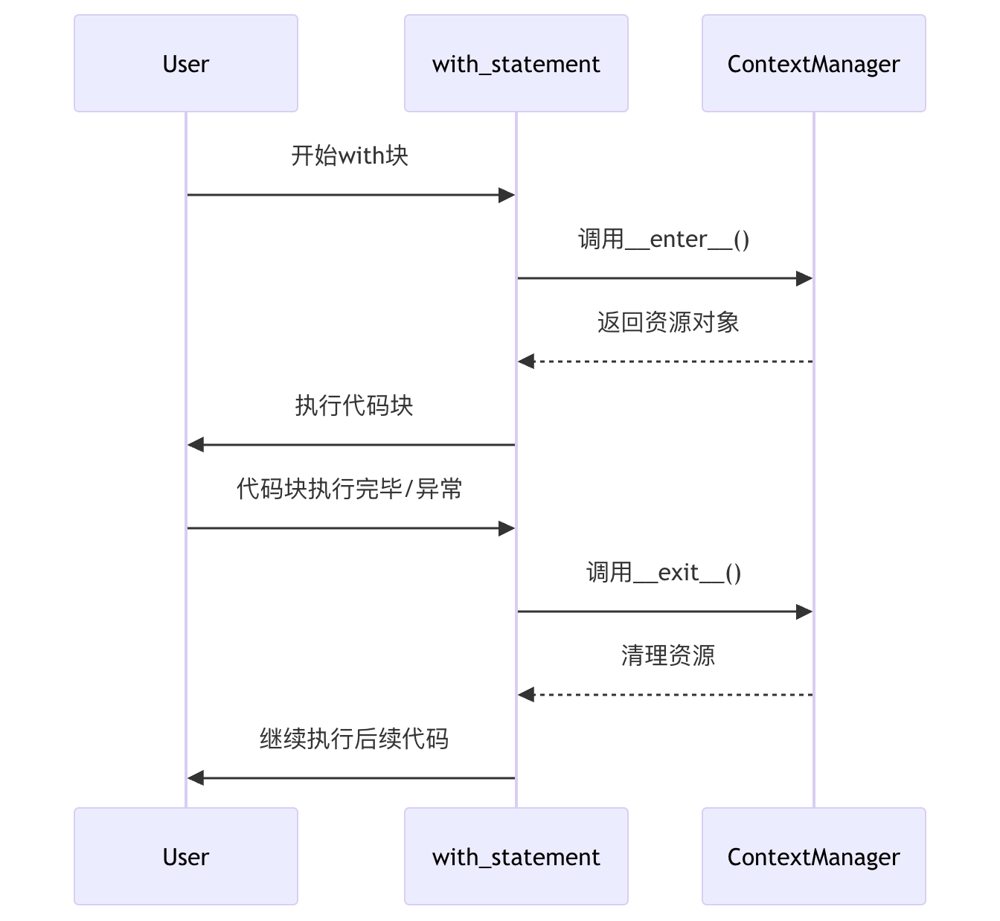

# 文件与数据处理

## 1 Python3 标准库

标准库位于：Python314\Lib，我们可以使用标准库更快捷的完成各种任务。

- **os 模块**：提供了许多与操作系统交互的函数，如创建、移动和删除文件和目录，以及访问环境变量等。
- **sys 模块**：提供了与 Python 解释器和系统相关的功能，如解释器的版本和路径，以及与 stdin、stdout 和 stderr 相关的信息。
- **time 模块**：提供了处理时间的函数，如获取当前时间、格式化日期和时间、计时等。
- **datetime 模块**：提供了更高级的日期和时间处理函数，如处理时区、计算时间差、计算日期差等。
- **random 模块**：提供了生成随机数的函数，如生成随机整数、浮点数、序列等。
- **math 模块**：提供了数学函数，如三角函数、对数函数、指数函数、常数等。
- **re 模块**：提供了正则表达式处理函数，可以用于文本搜索、替换、分割等。
- **json 模块**：提供了 JSON 编码和解码函数，可以将 Python 对象转换为 JSON 格式，并从 JSON 格式中解析出 Python 对象。
- **urllib 模块**：urllib 模块提供了访问网页和处理 URL 的功能，包括下载文件、发送 POST 请求、处理 cookies 等。

### 操作系统接口
os 模块提供了不少与操作系统相关联的函数，如文件和目录的操作。
```python
import os

# 获取当前工作目录
current_dir = os.getcwd()
print("当前工作目录:", current_dir)

# 列出目录下的文件
files = os.listdir(current_dir)
print("目录下的文件:", files)
```
- 建议使用 import os 风格而非 from os import *，确保随操作系统不同而有所变化的 os.open() 不会覆盖内置函数 open()。
- 在使用 os 这样的大型模块时内置的 dir() 和 help() 函数非常有用：
    - dir(os)：查看 os 模块的所有函数列表
    - help(os)：查看 os 模块帮助手册

## 2 文件读写

- 文件读写是 Python “输入与输出”模块的重要组成部分，它通过 **文件对象（File Objects）** 充当程序与操作系统磁盘数据之间的桥梁。
- 在 Python 中，文件被视为一种可以迭代的对象，支持逐行读取或按需写入。

### 作用
- **持久化存储**：将内存中的数据（如变量、对象）保存到磁盘，确保程序关闭后数据不丢失。
- **配置管理**：读取 .env 或 json 等配置文件来初始化程序参数。
- **数据交换**：使用 JSON 或 CSV 等标准格式与外部系统共享结构化数据。
- **多媒体处理**：在 Web 框架（如 FastAPI）中处理用户上传的图片、文档等二进制数据。

### 基本流程
标准的文件操作遵循 **“打开 → 操作 → 关闭”** 的生命周期：

- **打开 (Open)**：调用内置函数 open()，指定文件路径和模式（如只读、写入、追加），获取文件对象。
- **操作 (Operate)**：调用文件对象的方法，如 read() 读取内容、write() 写入数据或 readline() 逐行处理。
- **关闭 (Close)**：显式调用 close() 方法释放系统资源。
    - 推荐是使用 with 语句（上下文管理器），它能实现“预定义的清理操作”，在操作完成后自动关闭文件，即使发生异常也能确保资源安全释放。

demo 示例：[manual_file](../codes/python_base/app/manual_file.py)

### 场景与局限性

- **适用场景**：
    - 处理小型配置文件。
    - 日志记录（Logging）。
    - 简单的离线数据备份。

- **局限性**：
    - 性能瓶颈：频繁的磁盘 I/O 操作比内存操作慢得多。
    - 并发冲突：原始的文件读写不支持多个进程同时安全地写入同一文件。
    - 检索效率：不像数据库，文件系统难以对海量数据进行复杂的条件查询或索引。

### 其他关键点

- **访问模式**：常用模式包括 'r' (只读)、'w' (只写)、'a' (追加) 和 'b' (二进制模式，用于图片/音频)。
- **结构化存储**：对于复杂的列表或字典，推荐使用内置的 json 模块 进行序列化（json.dump）和反序列化（json.load）。
- **临时文件**：在自动化测试（如 pytest）中，可以使用专门的 tmp_path 等 Fixtures 来创建测试完即销毁的临时目录和文件，保证环境整洁。

### 替代方案

- ``pathlib``：现代 Python 开发推荐使用 pathlib 模块来替代传统的字符串路径操作，它提供面向对象的接口，具有更好的跨平台兼容性。
- ``pickle``：用于将几乎任何 Python 对象序列化为二进制格式（但注意其安全性，仅限信任的数据源）。
- ``StringIO``：在内存中模拟文件操作，适合不需要真实磁盘写入的缓存场景。
- ``FastAPI UploadFile``：在 Web 接口中，使用 FastAPI 提供的 UploadFile 类可以更高效地处理网络上传文件，它支持内存缓冲并在必要时才写入磁盘。
- ``数据库``：对于具有复杂关系、高并发要求或超大规模的数据，应使用 SQL 或 NoSQL 数据库替代文件存储。


## 3 with 语句
with 语句是 Python 提供的一种用于执行**预定义清理操作**（Predefined clean-up actions）的语法结构。被称为上下文管理器，能够自动管理资源的“开启”与“关闭”（如文件、网络连接、数据库连接等）。

为什么用它：
- **防止资源泄露**：在手动模式（open/close）下，如果操作中途报错，close() 可能永远不会执行；而 with 保证无论是否发生异常，清理工作都会被触发。
- **代码简洁**：它取代了冗长的 try...finally 结构，使代码更加优雅、易读。
- **健壮性**：它将“怎么操作资源”与“怎么清理资源”解耦，降低了开发者由于疏忽导致系统崩溃的概率

### 基本语法
with 语句基本用法：
```python
with 表达式 [as 变量]:
    # 在此缩进块内执行操作
```
- demo 示例：[with_demo](../codes/python_base/app/with_demo.py)

### 工作原理

#### 上下文管理协议
with 语句背后是 Python 的上下文管理协议，该协议要求对象实现两个方法：

- ``__enter__()``：进入上下文时调用，返回值赋给 as 后的变量
- ``__exit__()``：退出上下文时调用，处理清理工作

#### 执行流程



#### 异常处理机制
``__exit__()`` 方法接收三个参数：

- exc_type：异常类型
- exc_val：异常值
- exc_tb：异常追踪信息

如果 __exit__() 返回 True，则表示异常已被处理，不会继续传播；返回 False 或 None，异常会继续向外传播。


### 应用场景
- **文件读写**：确保文件句柄被及时释放。
- **自动化测试**：在 pytest 中，可以使用 with 配合 pytest.raises() 来断言代码是否正确抛出了预期的异常。
- **FastAPI 依赖注入**：在 FastAPI 中，可以使用带有 yield 的函数作为依赖项，这实际上是一种异步的上下文管理模式，用于在处理 API 请求前后自动管理数据库连接等资源。
- **并发编程**：在使用线程锁（Lock）或进程池时，通过 with 确保锁在操作完成后能被自动释放，避免死锁。
- **临时环境**：在测试中使用 pytest 提供的临时目录（tmp_path），确保测试数据在运行结束后被物理清除。

### 最佳实践
- **优先使用 with 管理资源**：对于文件、网络连接、锁等资源，总是优先考虑使用 with 语句
- **保持上下文简洁**：with 块中的代码应该只包含与资源相关的操作
- **合理处理异常**：在自定义上下文管理器中，根据需求决定是否抑制异常
- **利用多个上下文**：Python 允许在单个 with 语句中管理多个资源


