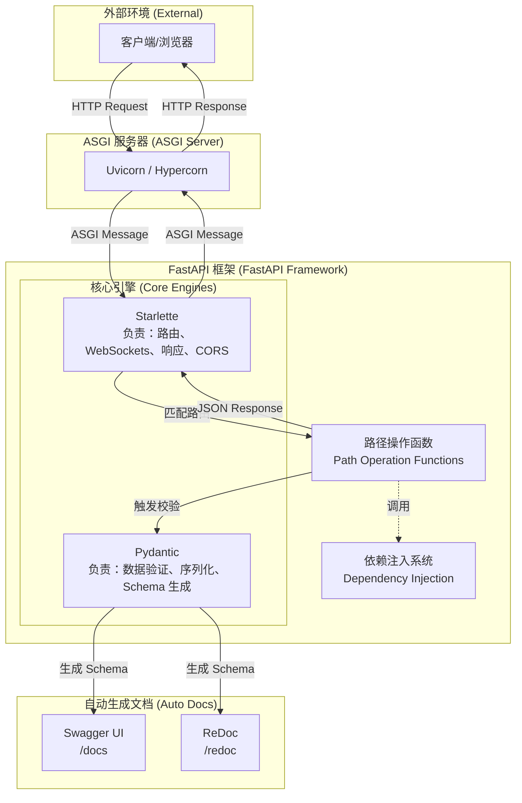

# FastAPI 框架

FastAPI 是一个用于构建 API 的现代、快速（高性能）的 Web 框架。它基于标准的 Python 类型提示（Type Hints） 构建。

核心优势：
- **高性能**：可与 NodeJS 和 Go 并肩，是目前最快的 Python 框架之一。
- **高效率**：开发速度可提升约 200% 至 300%，并能减少约 40% 的人为开发错误。
- **标准化**：完全兼容 OpenAPI（原 Swagger）和 JSON Schema 开放标准。

[fastapi_demo](../codes/python_base/app/fastapi_demo.py)

## 1 FastAPI 核心架构

- FastAPI 的成功在于其“站在巨人的肩膀上”，它主要依赖于两个核心库：``Starlette、Pydantic``。

### 架构层级详解

**1> 运行环境层 (Uvicorn)**

- 作为底层的 ASGI 服务器，它是 FastAPI 应用的运行载体，支持 async/await 异步特性，确保了极高的并发处理能力。
- ``Uvicorn`` 是最常用的选择，它负责监听网络端口，**接收原始的 HTTP 请求** 并将其 **转化** 为应用可以理解的 **ASGI 消息**。

**2> Web 支撑层 (Starlette)**

- FastAPI 建立在 Starlette（执行引擎）之上，负责所有的 Web 核心功能。
- 它的职责包括：管理路由（将 URL 映射到对应的函数）、处理请求和响应、WebSockets 支持、管理 CORS（跨域） 等。

**3> 数据支持层 (Pydantic)**

- 负责所有的数据处理功能，涵盖数据验证、序列化以及基于 Python 类型提示的模式声明。
- 其核心验证逻辑由 Rust 编写，这使得 FastAPI 成为最快的 Python 框架之一

**4> 接口契约层 (OpenAPI & Schema)**

- 通过一次参数声明，FastAPI 会自动生成 JSON Schema。
- 这些 Schema 直接驱动了自动生成的交互式文档：Swagger UI 和 ReDoc。

## 2 请求处理全流程

当一个 HTTP 请求到达 FastAPI 应用时，其内部流程如下：
- **路由匹配**：Uvicorn 接收请求并交给 FastAPI，FastAPI 根据路径和 HTTP 方法寻找对应的处理函数。
- **依赖解析**：执行函数前，先解析并运行该接口依赖的所有子项（如检查登录状态）。
- **提取与校验**：从请求中提取数据，通过 Pydantic 进行类型校验和强制转换。
- **业务执行**：运行开发者编写的函数体逻辑。
- **输出序列化**：将函数返回的 Python 对象（或模型、数据库对象）自动转换为标准的 JSON 数据，并校验响应是否符合预期的响应模型。
- **返回响应**：通过 ASGI 接口将结果返回给客户端。

## 3 核心组件 & 特性
FastAPI 的工作原理可以用 **“声明式驱动”** 来概括。

### 3.1 核心组件

- ``FastAPI`` 类：应用的主入口，用于配置元数据、挂载路由等。
- ``APIRouter``：用于构建大型应用时进行路由分块管理。
- ``Pydantic`` 模型 (BaseModel)：定义请求和响应的数据结构。
- ``Depends`` (依赖注入系统)：通过 Depends() 轻松地实现逻辑复用（如数据库连接、安全认证 OAuth2/JWT），并将这些逻辑解耦到独立的函数或类中。

- ``FastAPI CLI``：提供命令行工具（如 fastapi dev）用于开发和部署。

### 3.2 核心特性

**1> 类型提示驱动 (Type Hints Driven)**

开发者只需要使用标准的 Python 类型声明一次参数，FastAPI 就会自动接管后续的所有逻辑。
- **输入转换**：自动从网络请求（JSON、路径参数、查询参数、Cookies 等）中读取数据并转换为对应的 Python 类型。
- **数据校验**：利用 Pydantic 校验数据合法性。如果数据不符合声明的类型（如应为 int 却传了 str），系统会自动生成清晰的 JSON 错误信息返回给客户端。

**2> 自动文档生成**

- FastAPI 根据代码中的 Pydantic 模型和函数定义，实时生成符合 OpenAPI（原 Swagger）和 JSON Schema 标准的元数据。提供了两种交互式 Web 界面：Swagger UI（访问 /docs）和 ReDoc（访问 /redoc）
- FastAPI 自动生成文档的性能开销可以忽略不计，因为它遵循 **“启动时生成、路径隔离访问”**的原则。这种设计在保证开发者获得极佳开发体验的同时，确保了生产环境业务逻辑的高性能运行。

**3> 异步并发机制 (Async/Await)**：如果路径操作函数使用 async def 声明，FastAPI 会以非阻塞的方式在 ASGI 服务器上运行它。

**4> 深度集成编辑器**：得益于类型提示，在 VS Code 等编辑器中拥有极佳的自动补全和错误检查功能。

## 4 适用场景
FastAPI 已被多家顶级科技公司用于生产环境：
- 机器学习 (ML) 服务：微软计划将其用于核心产品中的 ML 服务集成。
- 高性能数据服务器：Uber 使用它启动 REST 服务器以查询预测结果。
- 危机管理系统：Netflix 使用其构建危机管理编排框架 Dispatch。
- 生产级 API 优先战略：思科 (Cisco) 将其作为 API 开发的关键组件。

## 5 和同类框架对比
- **性能对比**：在独立机构的基准测试中，运行在 Uvicorn 下的 FastAPI 是最快的 Python 框架之一，速度远超 Django 和 Flask，仅次于其底层的 Starlette 和 Uvicorn。
- **开发体验**：相比于 Flask 等传统框架需要手动编写文档或通过插件实现校验，FastAPI 将数据验证、转换和文档生成原生集成，大幅减少了重复代码。
- **现代特性**：FastAPI 完全基于 Python 3.8+ 的现代特性（如类型提示、异步），而老牌框架往往需要兼顾旧版本的兼容性。

